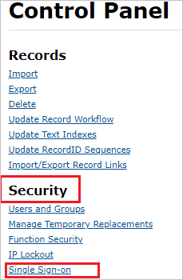

## Prerequisites

To configure Azure AD integration with Nimblex, you need the following items:

- An Azure AD subscription
- A Nimblex single sign-on enabled subscription

> **Note:**
> To test the steps in this tutorial, we do not recommend using a production environment.

To test the steps in this tutorial, you should follow these recommendations:

- Do not use your production environment, unless it is necessary.
- If you don't have an Azure AD trial environment, you can [get a one-month trial](https://azure.microsoft.com/pricing/free-trial/).

### Configuring Nimblex for single sign-on

1. In a different web browser window, log in to Nimblex as a Security Administrator.

2. On the top right side of the page, click **Settings** logo.

	

3. On the **Control Panel** page, under **Security** section click **Single Sign-on**.

	

4. On the **Manage Single Sign-On** page, select your instance name and click **Edit**.

	

5. On the **Edit SSO Provider** page, perform the following steps:

	

	a. In the **Description** textbox, type your instance name.

	b. In Notepad, open the **[Downloaded Azure AD Signing Certifcate (Base64 encoded)](%metadata:certificateDownloadBase64Url%)** from the Azure portal, copy its content, and then paste it into the **Certificate** box.

	c. In the **Identity Provider Sso Target Url** textbox, paste the value of **Azure AD Single Sign-On Service URL** : %metadata:singleSignOnServiceUrl%, which you have copied from the Azure portal.

	d. Click **Save**.

## Quick Reference

* **Azure AD Single Sign-On Service URL** : %metadata:singleSignOnServiceUrl%

* **[Download Azure AD Signing Certifcate (Base64 encoded)](%metadata:certificateDownloadBase64Url%)**

## Additional Resources

* [How to integrate Nimblex with Azure Active Directory](https://docs.microsoft.com/azure/active-directory/saas-apps/nimblex-tutorial)
