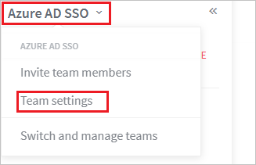
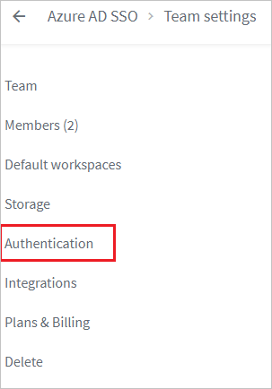
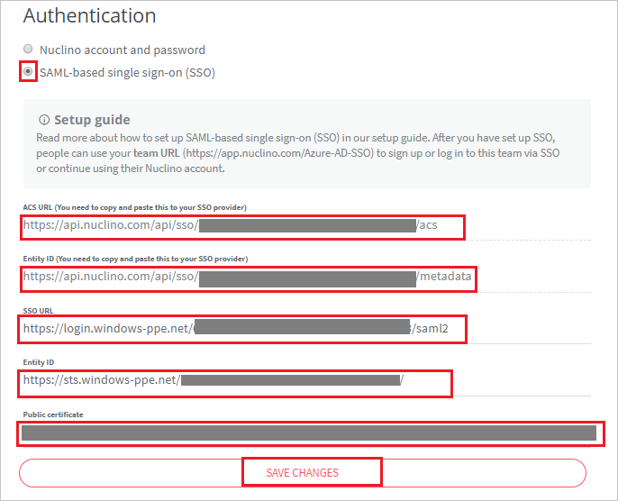

## Prerequisites

To configure Azure AD integration with Nuclino, you need the following items:

- An Azure AD subscription
- A Nuclino single sign-on enabled subscription

> **Note:**
> To test the steps in this tutorial, we do not recommend using a production environment.

To test the steps in this tutorial, you should follow these recommendations:

- Do not use your production environment, unless it is necessary.
- If you don't have an Azure AD trial environment, you can [get a one-month trial](https://azure.microsoft.com/pricing/free-trial/).

### Configuring Nuclino for single sign-on

1. In a different web browser window, sign in to your Nuclino company site as an administrator.

2. Click on the **ICON**.

	

3. Click on the **Azure AD SSO** and select **Team settings** from the dropdown.

	

4. Select **Authentication** from left navigation pane.

	

5. In the **Authentication** section, perform the following steps:

	

	a. Select **SAML-based single sign-on (SSO)**.

	b. Copy **ACS URL (You need to copy and paste this to your SSO provider)** value and paste it into the **Reply URL** textbox of the **Nuclino Domain and URLs** section in the Azure portal.

	c. Copy **Entity ID (You need to copy and paste this to your SSO provider)** value and paste it into the **Identifier** textbox of the **Nuclino Domain and URLs** section in the Azure portal.

	d. In the **SSO URL** textbox, paste the **Azure AD Single Sign-On Service URL** : %metadata:singleSignOnServiceUrl% value which you have copied from the Azure portal.

	e. In the **Entity ID** textbox, paste the **Azure AD SAML Entity ID** : %metadata:IssuerUri% value which you have copied from the Azure portal.

	f. Open your **[Downloaded Azure AD Signing Certifcate (Base64 encoded)](%metadata:certificateDownloadBase64Url%)** file in Notepad. Copy the content of it into your clipboard, and then paste it to the **Public certificate** text box.

	g. Click **SAVE CHANGES**.

## Quick Reference

* **Azure AD Single Sign-On Service URL** : %metadata:singleSignOnServiceUrl%

* **Azure AD SAML Entity ID** : %metadata:IssuerUri%

* **[Download Azure AD Signing Certifcate (Base64 encoded)](%metadata:certificateDownloadBase64Url%)**

## Additional Resources

* [How to integrate Nuclino with Azure Active Directory](https://docs.microsoft.com/azure/active-directory/saas-apps/nuclino-tutorial)
