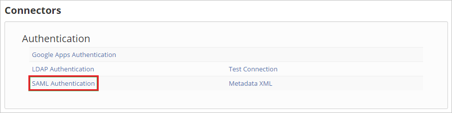
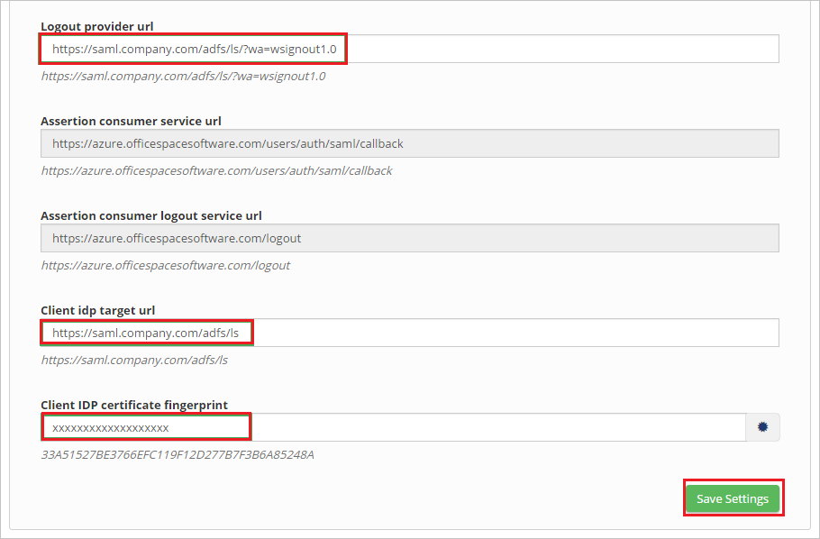

## Prerequisites

To configure Azure AD integration with OfficeSpace Software, you need the following items:

- An Azure AD subscription
- A OfficeSpace Software single sign-on enabled subscription

> **Note:**
> To test the steps in this tutorial, we do not recommend using a production environment.

To test the steps in this tutorial, you should follow these recommendations:

- Do not use your production environment, unless it is necessary.
- If you don't have an Azure AD trial environment, you can get a one-month trial [here](https://azure.microsoft.com/pricing/free-trial/).

### Configuring OfficeSpace Software for single sign-on

1. In a different web browser window, log into your OfficeSpace Software tenant as an administrator.

2. Go to **Settings** and click **Connectors**.

	

3. Click **SAML Authentication**.

	

4. In the **SAML Authentication** section, perform the following steps:

	

	a. In the **Logout provider url** textbox, paste the value of **Azure AD Sign Out URL** : %metadata:singleSignOutServiceUrl% which you have copied from Azure portal.

	b. In the **Client idp target url** textbox, paste the value of **Azure AD Single Sign-On Service URL** : %metadata:singleSignOnServiceUrl% which you have copied from Azure portal.

	c. Paste the **Thumbprint** value which you have copied from Azure portal, into the **Client IDP certificate fingerprint** textbox. 

	d. Click **Save Settings**.

## Quick Reference

* **Azure AD Single Sign-On Service URL** : %metadata:singleSignOnServiceUrl%

* **Azure AD Sign Out URL** : %metadata:singleSignOutServiceUrl%

* **[Download Azure AD Signing Certifcate (Base64 encoded)](%metadata:certificateDownloadBase64Url%)**

## Additional Resources

* [How to integrate OfficeSpace Software with Azure Active Directory](https://docs.microsoft.com/azure/active-directory/active-directory-saas-officespace-tutorial)
