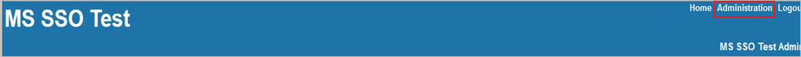
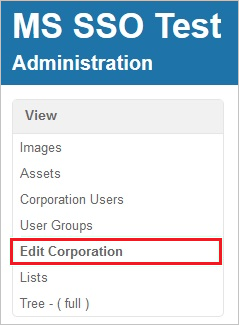
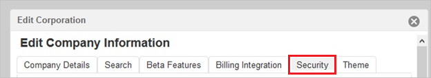
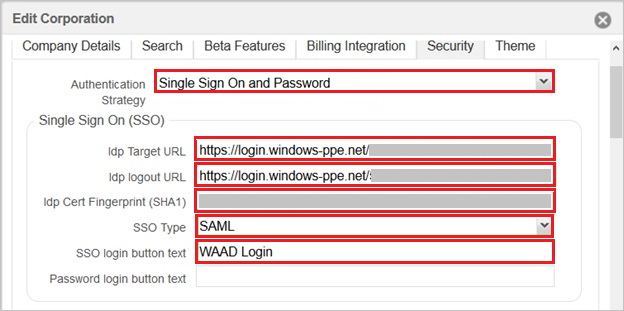

## Prerequisites

To configure Azure AD integration with Onit, you need the following items:

- An Azure AD subscription
- A Onit single sign-on enabled subscription

> **Note:**
> To test the steps in this tutorial, we do not recommend using a production environment.

To test the steps in this tutorial, you should follow these recommendations:

- Do not use your production environment, unless it is necessary.
- If you don't have an Azure AD trial environment, you can get a one-month trial [here](https://azure.microsoft.com/pricing/free-trial/).

### Configuring Onit for single sign-on

1. In a different web browser window, log into your Onit company site as an administrator.

2. In the menu on the top, click **Administration**.
   
    

3. Click **Edit Corporation**.
   
    
   
4. Click the **Security** tab.
    
    

5. On the **Security** tab, perform the following steps:

	

	a. As **Authentication Strategy**, select **Single Sign On and Password**.
	
	b. In **Idp Target URL** textbox, paste the value of **Azure AD Single Sign-On Service URL** : %metadata:singleSignOnServiceUrl%, which you have copied from Azure portal.

	c. In **Idp logout URL** textbox, paste the value of  **Azure AD Sign Out URL** : %metadata:singleSignOutServiceUrl%, which you have copied from Azure portal.

	d. In **Idp Cert Fingerprint (SHA1)** textbox, paste the  **Thumbprint** value of certificate, which you have copied from Azure portal.

## Quick Reference

* **Azure AD Single Sign-On Service URL** : %metadata:singleSignOnServiceUrl%

* **Azure AD Sign Out URL** : %metadata:singleSignOutServiceUrl%

* **[Download Azure AD Signing Certifcate](%metadata:CertificateDownloadRawUrl%)**

## Additional Resources

* [How to integrate Onit with Azure Active Directory](https://docs.microsoft.com/azure/active-directory/active-directory-saas-onit-tutorial)
