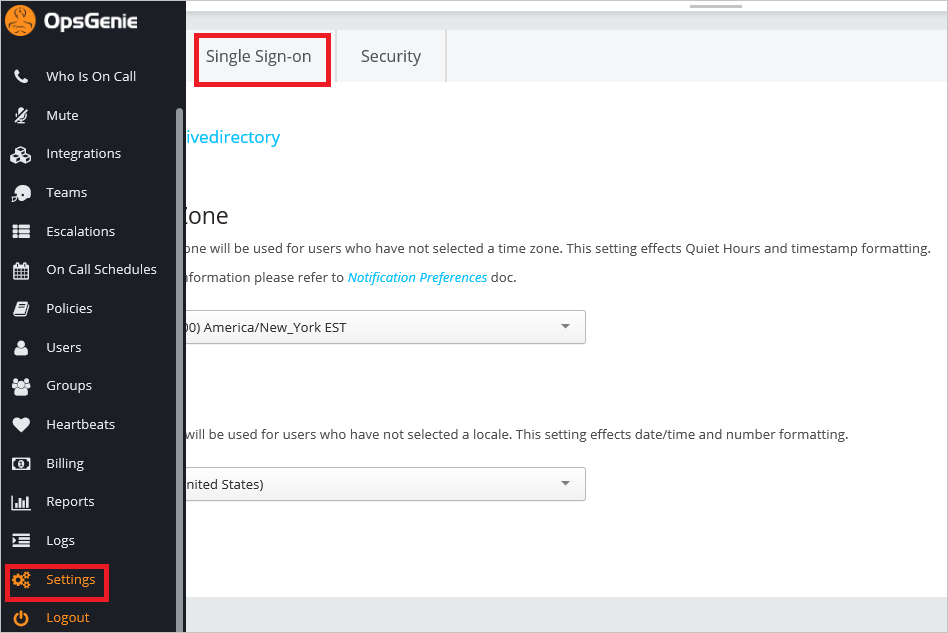

## Prerequisites

To configure Azure AD integration with OpsGenie, you need the following items:

- An Azure AD subscription
- A OpsGenie single sign-on enabled subscription

> **Note:**
> To test the steps in this tutorial, we do not recommend using a production environment.

To test the steps in this tutorial, you should follow these recommendations:

- Do not use your production environment, unless it is necessary.
- If you don't have an Azure AD trial environment, you can get a one-month trial [here](https://azure.microsoft.com/pricing/free-trial/).

### Configuring OpsGenie for single sign-on

1. Open another browser instance, and then log-in to OpsGenie as an administrator.

2. Click **Settings**, and then click the **Single Sign On** tab.
   
    

3. To enable SSO, select **Enabled**.
   
     

4. In the **Provider** section, click the **Azure Active Directory** tab.
   
     

5. On the Azure Active Directory dialog page, perform the following steps:
   
    
	
	a. Paste **Azure AD Single Sign-On Service URL** : %metadata:singleSignOnServiceUrl%, which you have copied from the Azure portal into the **SAML 2.0 Endpoint** textbox.
	
	b. Open your **[Downloaded Azure AD Signing Certifcate (Base64 encoded)](%metadata:certificateDownloadBase64Url%)** in notepad, copy the content of it into your clipboard, and then paste it into the **X.500 Certificate** textbox.
	
	c. Click **Save Changes**.

## Quick Reference

* **Azure AD Single Sign-On Service URL** : %metadata:singleSignOnServiceUrl%

* **Azure AD Sign Out URL** : %metadata:singleSignOutServiceUrl%

* **Azure AD SAML Entity ID** : %metadata:IssuerUri%

* **[Download Azure AD Signing Certifcate (Base64 encoded)](%metadata:certificateDownloadBase64Url%)**

## Additional Resources

* [How to integrate OpsGenie with Azure Active Directory](https://docs.microsoft.com/azure/active-directory/active-directory-saas-opsgenie-tutorial)
