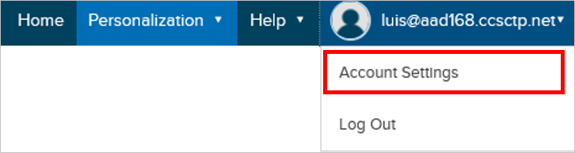

## Prerequisites

To configure Azure AD integration with Optimizely, you need the following items:

- An Azure AD subscription
- An Optimizely single-sign on enabled subscription

> **Note:**
> To test the steps in this tutorial, we do not recommend using a production environment.

To test the steps in this tutorial, you should follow these recommendations:

- Do not use your production environment, unless it is necessary.
- If you don't have an Azure AD trial environment, you can get a one-month trial [here](https://azure.microsoft.com/pricing/free-trial/).

### Configuring Optimizely for single sign-on

1. To configure single sign-on on **Optimizely** side, you need to send the downloaded **[Certificate(Base64)](%metadata:certificateDownloadBase64Url%)** and **Azure AD Single Sign-On Service URL**: %metadata:singleSignOnServiceUrl% to [Optimizely support](https://www.optimizely.com/contact).

2. In a different browser window, sign-on to your Optimizely application.

3. Click you account name in the top right corner and then **Account Settings**.
   
    

4. In the Account tab, check the box **Enable SSO** under Single Sign On in the **Overview** section.
   
    

## Quick Reference

* **Azure AD Single Sign-On Service URL**: %metadata:singleSignOnServiceUrl%

* **[Download Azure AD Signing Certificate (Base64 encoded)](%metadata:certificateDownloadBase64Url%)**

## Additional Resources

* [How to integrate Optimizely with Azure Active Directory](active-directory-saas-optimizely-tutorial.md)
