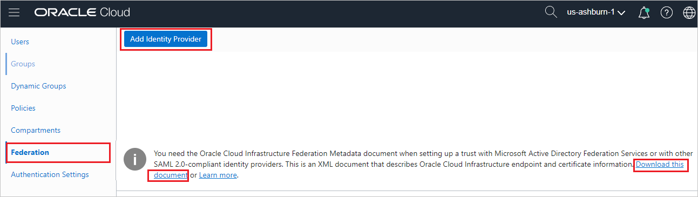
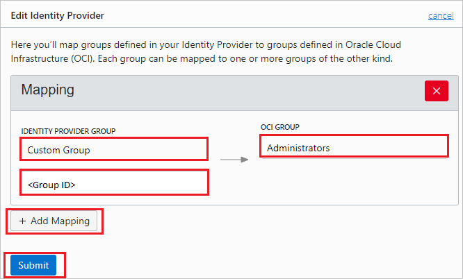

## Prerequisites

To configure Azure AD integration with Oracle Cloud, you need the following items:

- An Azure AD subscription
- An Oracle Cloud single sign-on enabled subscription

> **Note:**
> To test the steps in this tutorial, we do not recommend using a production environment.

To test the steps in this tutorial, you should follow these recommendations:

- Do not use your production environment, unless it is necessary.
- If you don't have an Azure AD trial environment, you can get a [free account](https://azure.microsoft.com/free/).

### Configuring Oracle Cloud for single sign-on

1. In a different web browser window, sign in to Oracle Cloud Infrastructure Console as an Administrator.

2. Click on the left side of the menu and click on **Identity** then navigate to **Federation**.

	

3. Save the **Service Provider metadata file** by clicking the **Download this document** link and upload it into the **Basic SAML Configuration** section of Azure portal and then click on **Add Identity Provider**.

	

4. On the **Add Identity Provider** pop-up, perform the following steps:

	

	a. In the **NAME** text box, enter your name.

	b. In the **DESCRIPTION** text box, enter your description.

	c. Select **MICROSOFT ACTIVE DIRECTORY FEDERATION SERVICE (ADFS) OR SAML 2.0 COMPLIANT IDENTITY PROVIDER** as **TYPE**.

	d. Click **Browse** to upload the **[Downloaded SAML Metadata file](%metadata:metadataDownloadUrl%)** from Azure portal.

	e. Click **Continue** and on the **Edit Identity Provider** section perform the following steps:

	

	f. For **IDENTITY PROVIDER GROUP** fields, enter the group name and group id that are set up in Azure portal. The group needs to be mapped with corresponding group in **OCI GROUP** field.

	g. You can map multiple groups as per your setup in Azure portal and your organization need. Click on **+ Add mapping** to add as many groups as you need.

	h. Click **Submit**.

## Quick Reference

* **[Download Azure AD Signing Certifcate](%metadata:CertificateDownloadRawUrl%)**

* **[Download SAML Metadata file](%metadata:metadataDownloadUrl%)**

## Additional Resources

* [How to integrate Oracle Cloud with Azure Active Directory](https://docs.microsoft.com/azure/active-directory/saas-apps/oracle-cloud-tutorial)
