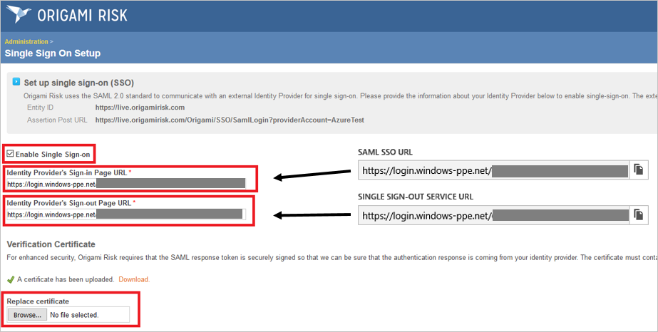

## Prerequisites

To configure Azure AD integration with Origami, you need the following items:

- An Azure AD subscription
- An Origami single sign-on enabled subscription

> **Note:**
> To test the steps in this tutorial, we do not recommend using a production environment.

To test the steps in this tutorial, you should follow these recommendations:

- Do not use your production environment, unless it is necessary.
- If you don't have an Azure AD trial environment, you can get a one-month trial [here](https://azure.microsoft.com/pricing/free-trial/).

### Configuring Origami for single sign-on

1. Log in to the Origami account with Admin rights.

2. In the menu on the top, click **Admin**.
   
    

3. On the Single Sign On Setup dialog page, perform the following steps:
   
    

    a. Select **Enable Single Sign On**.

    b. In the **Identity Provider's Sign-in Page URL** textbox, paste the value of **Azure AD Single Sign-On Service URL** : %metadata:singleSignOnServiceUrl%, which you have copied from Azure portal.

    c. In the **Identity Provider's Sign-out Page URL** textbox, paste the value of **Azure AD Sign Out URL** : %metadata:singleSignOutServiceUrl%, which you have copied from Azure portal.

    d. Click **Browse** to upload the **[Downloaded Azure AD Signing Certifcate (Base64 encoded)](%metadata:certificateDownloadBase64Url%)**
    from the Azure portal.

    e. Click **Save Changes**.

## Quick Reference

* **Azure AD Single Sign-On Service URL** : %metadata:singleSignOnServiceUrl%

* **Azure AD Sign Out URL** : %metadata:singleSignOutServiceUrl%

* **[Download Azure AD Signing Certifcate (Base64 encoded)](%metadata:certificateDownloadBase64Url%)**

## Additional Resources

* [How to integrate Origami with Azure Active Directory](https://docs.microsoft.com/azure/active-directory/active-directory-saas-origami-tutorial)
