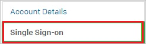
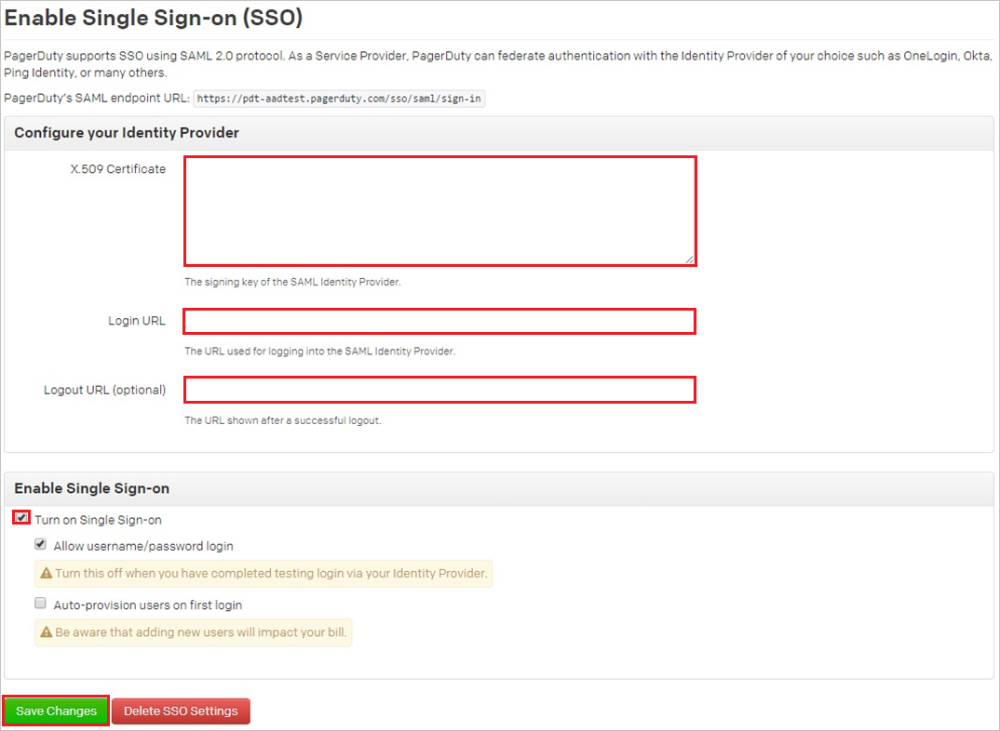

## Prerequisites

To configure Azure AD integration with Pagerduty, you need the following items:

- An Azure AD subscription
- A Pagerduty single sign-on enabled subscription

> **Note:**
> To test the steps in this tutorial, we do not recommend using a production environment.

To test the steps in this tutorial, you should follow these recommendations:

- Do not use your production environment, unless it is necessary.
- If you don't have an Azure AD trial environment, you can get a one-month trial [here](https://azure.microsoft.com/pricing/free-trial/).

### Configuring Pagerduty for single sign-on

1. In a different web browser window, log into your Pagerduty company site as an administrator.

2. In the menu on the top, click **Account Settings**.
   
    

3. Click **Single Sign-on**.
   
    

4. On the **Enable Single Sign-on (SSO)** page, perform the following steps:
   
    
   
    a. Open your **[Downloaded Azure AD Signing Certifcate (Base64 encoded)](%metadata:certificateDownloadBase64Url%)** from Azure portal in notepad, copy the content of it into your clipboard, and then paste it to the **X.509 Certificate** textbox
  
    b. In the **Login URL** textbox, paste **Azure AD Single Sign-On Service URL** : %metadata:singleSignOnServiceUrl% which you have copied from Azure portal.
  
    c. In the **Logout URL** textbox, paste **Azure AD Sign Out URL** : %metadata:singleSignOutServiceUrl% which you have copied from Azure portal.
 
    d. Select **Turn on Single Sign-on**.
 
    e. Click **Save Changes**.

## Quick Reference

* **Azure AD Single Sign-On Service URL** : %metadata:singleSignOnServiceUrl%

* **Azure AD Sign Out URL** : %metadata:singleSignOutServiceUrl%

* **[Download Azure AD Signing Certifcate (Base64 encoded)](%metadata:certificateDownloadBase64Url%)**

## Additional Resources

* [How to integrate Pagerduty with Azure Active Directory](https://docs.microsoft.com/azure/active-directory/active-directory-saas-pagerduty-tutorial)
