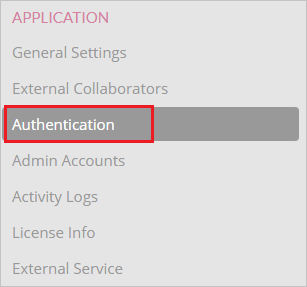
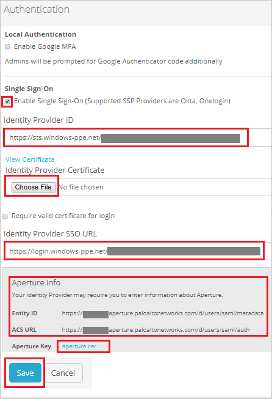

## Prerequisites

To configure Azure AD integration with Palo Alto Networks - Aperture, you need the following items:

- An Azure AD subscription
- A Palo Alto Networks - Aperture single sign-on enabled subscription

> **Note:**
> To test the steps in this tutorial, we do not recommend using a production environment.

To test the steps in this tutorial, you should follow these recommendations:

- Do not use your production environment, unless it is necessary.
- If you don't have an Azure AD trial environment, you can [get a one-month trial](https://azure.microsoft.com/pricing/free-trial/).

### Configuring Palo Alto Networks - Aperture for single sign-on

1. In a different web browser window, login to Palo Alto Networks - Aperture as an Administrator.

2. On the top menu bar, click **SETTINGS**.

	

3. Navigate to **APPLICATION** section click **Authentication** form the left side of menu.

	
	
4. On the **Authentication** page perform the following steps:
	
	

	a. Check the **Enable Single Sign-On(Supported SSP Providers are Okta, Onelogin)** from **Single Sign-On** field.

	b. In the **Identity Provider ID** textbox, paste the value of **Azure AD SAML Entity ID** : %metadata:IssuerUri%, which you have copied from Azure portal.

	c. Click **Choose File** to upload the **[Downloaded Azure AD Signing Certifcate (Base64 encoded)](%metadata:certificateDownloadBase64Url%)** from Azure AD in the **Identity Provider Certificate** field.

	d. In the **Identity Provider SSO URL** textbox, paste the value of **Azure AD Single Sign-On Service URL** : %metadata:singleSignOnServiceUrl%, which you have copied from Azure portal.

	e. Review the IdP information from **Aperture Info** section and download the certificate from **Aperture Key** field.

	f. Click **Save**.

## Quick Reference

* **Azure AD Single Sign-On Service URL** : %metadata:singleSignOnServiceUrl%

* **Azure AD SAML Entity ID** : %metadata:IssuerUri%

* **[Download Azure AD Signing Certifcate (Base64 encoded)](%metadata:certificateDownloadBase64Url%)**

## Additional Resources

* [How to integrate Palo Alto Networks - Aperture with Azure Active Directory](https://docs.microsoft.com/azure/active-directory/active-directory-saas-paloaltonetworks-aperture-tutorial)
