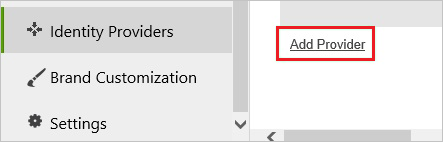

## Prerequisites

To configure Azure AD integration with panopto, you need the following items:

- An Azure AD subscription
- A panopto single sign-on enabled subscription

> **Note:**
> To test the steps in this tutorial, we do not recommend using a production environment.

To test the steps in this tutorial, you should follow these recommendations:

- Do not use your production environment, unless it is necessary.
- If you don't have an Azure AD trial environment, you can get a one-month trial [here](https://azure.microsoft.com/pricing/free-trial/).

### Configuring panopto for single sign-on

1. In a different web browser window, log in to your Panopto company site as an administrator.

2. In the toolbar on the left, click **System**, and then click **Identity Providers**.
   
    

3. Click **Add Provider**.
   
    
   
4. In the SAML provider section, perform the following steps:
   
    
	
	a. From the **Provider Type** list, select **SAML20**.    
	
	b. In the **Instance Name** textbox, type a name for the instance.

	c. In the **Friendly Description** textbox, type a friendly description.
	
	d. In **Bounce Page Url** textbox, paste the value of **Azure AD Single Sign-On Service URL** : %metadata:singleSignOnServiceUrl%, which you have copied from Azure portal.

	e. In the **Issuer** textbox, paste the value of **Azure AD SAML Entity ID** : %metadata:IssuerUri%, which you have copied from Azure portal.

	f. Open your **[Downloaded Azure AD Signing Certifcate (Base64 encoded)](%metadata:certificateDownloadBase64Url%)** from Azure portal, copy the content of it in to your clipboard, and then paste it to the **Public Key**  textbox.

5. Click **Save**.

## Quick Reference

* **Azure AD Single Sign-On Service URL** : %metadata:singleSignOnServiceUrl%

* **Azure AD SAML Entity ID** : %metadata:IssuerUri%

* **[Download Azure AD Signing Certifcate (Base64 encoded)](%metadata:certificateDownloadBase64Url%)**

## Additional Resources

* [How to integrate panopto with Azure Active Directory](https://docs.microsoft.com/azure/active-directory/active-directory-saas-panopto-tutorial)
