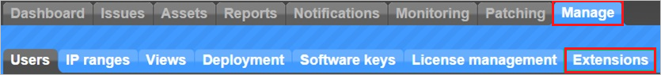
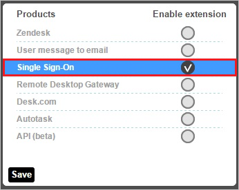
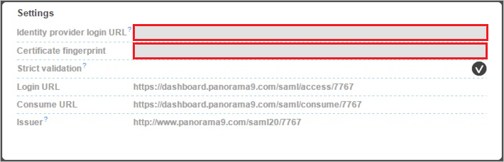

## Prerequisites

To configure Azure AD integration with Panorama9, you need the following items:

- An Azure AD subscription
- A Panorama9 single sign-on enabled subscription

> **Note:**
> To test the steps in this tutorial, we do not recommend using a production environment.

To test the steps in this tutorial, you should follow these recommendations:

- Do not use your production environment, unless it is necessary.
- If you don't have an Azure AD trial environment, you can get a one-month trial [here](https://azure.microsoft.com/pricing/free-trial/).

### Configuring Panorama9 for single sign-on

1. In a different web browser window, log into your Panorama9 company site as an administrator.

2. In the toolbar on the top, click **Manage**, and then click **Extensions**.
   
    
3. On the **Extensions** dialog, click **Single Sign-On**.
   
    

4. In the **Settings** section, perform the following steps:
   
    
   
	a. In **Identity provider URL** textbox, paste the value of **Azure AD Single Sign-On Service URL** : %metadata:singleSignOnServiceUrl%, which you have copied from Azure portal.
   
	b. In **Certificate fingerprint** textbox, paste the **Thumbprint** value of certificate, which you have copied from Azure portal.    
         
5. Click **Save**.

## Quick Reference

* **Azure AD Single Sign-On Service URL** : %metadata:singleSignOnServiceUrl%

* **[Download Azure AD Signing Certifcate](%metadata:CertificateDownloadRawUrl%)**

## Additional Resources

* [How to integrate Panorama9 with Azure Active Directory](https://docs.microsoft.com/azure/active-directory/active-directory-saas-panorama9-tutorial)
