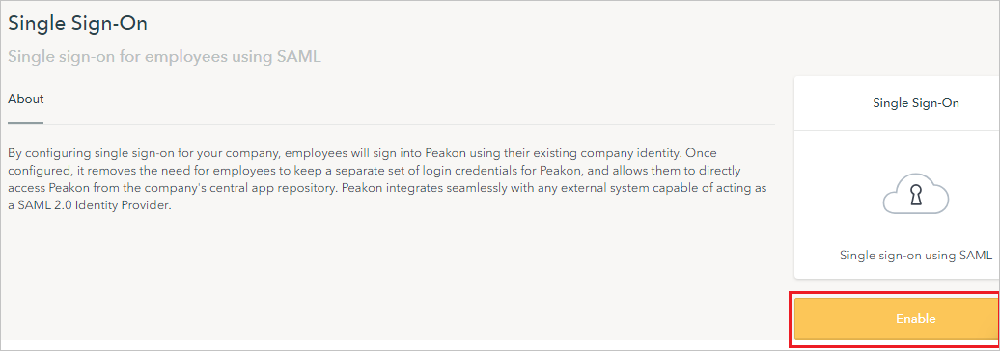

## Prerequisites

To configure Azure AD integration with Peakon, you need the following items:

- An Azure AD subscription
- A Peakon single sign-on enabled subscription

> **Note:**
> To test the steps in this tutorial, we do not recommend using a production environment.

To test the steps in this tutorial, you should follow these recommendations:

- Do not use your production environment, unless it is necessary.
- If you don't have an Azure AD trial environment, you can [get a one-month trial](https://azure.microsoft.com/pricing/free-trial/).

### Configuring Peakon for single sign-on

8. In a different web browser window, sign in to Peakon as an Administrator.

9. In the menu bar on the left side of the page, click **Configuration**, then navigate to **Integrations**.

	

10. On **Integrations** page, click on **Single Sign-On**.

	

11. Under **Single Sign-On** section, click on **Enable**.

	

12. On the **Single sign-on for employees using SAML** section, perform the following steps:

	

	a. In the **SSO Login URL** textbox, paste the value of **Login URL** : %metadata:singleSignOnServiceUrl%, which you have copied from the Azure portal.

	b. In the **SSO Logout URL** textbox, paste the value of **Logout URL**, which you have copied from the Azure portal.

	c. Click **Choose file** to upload the **[Downloaded Azure AD Signing Certifcate (Base64 encoded)](%metadata:certificateDownloadBase64Url%)** from the Azure portal, into the Certificate box.

	d. Click the **icon** to copy the **Entity ID** and paste in **Identifier** textbox in **Basic SAML Configuration** section on Azure portal.

	e. Click the **icon** to copy the **Reply URL (ACS)** and paste in **Reply URL** textbox in **Basic SAML Configuration** section on Azure portal.

	f. Click **Save**

## Quick Reference

* **Azure AD Single Sign-On Service URL** : %metadata:singleSignOnServiceUrl%

* **[Download Azure AD Signing Certifcate (Base64 encoded)](%metadata:certificateDownloadBase64Url%)**

## Additional Resources

* [How to integrate Peakon with Azure Active Directory](https://docs.microsoft.com/azure/active-directory/saas-apps/peakon-tutorial)
