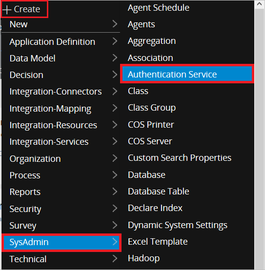
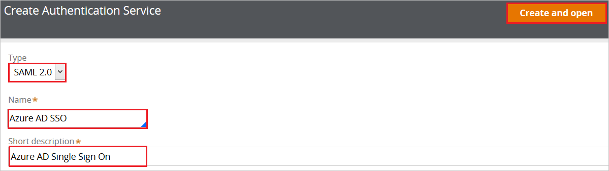
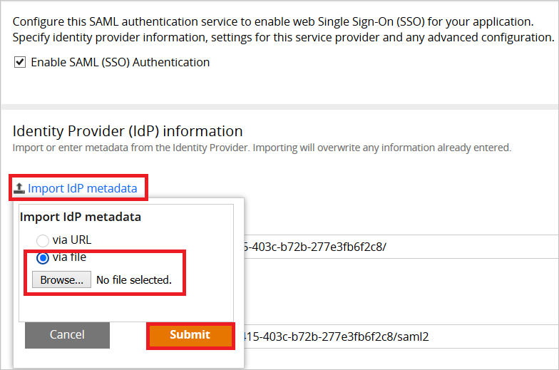
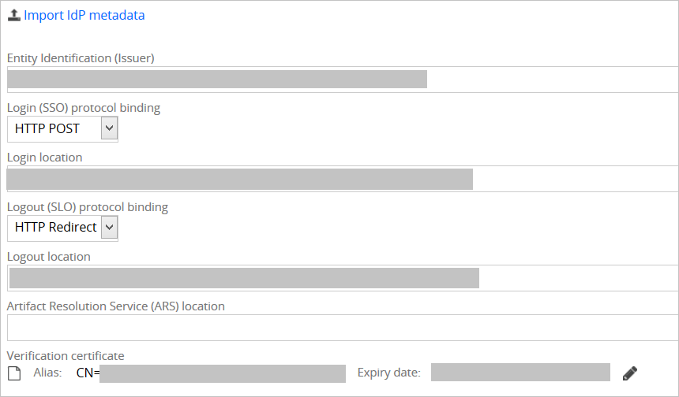
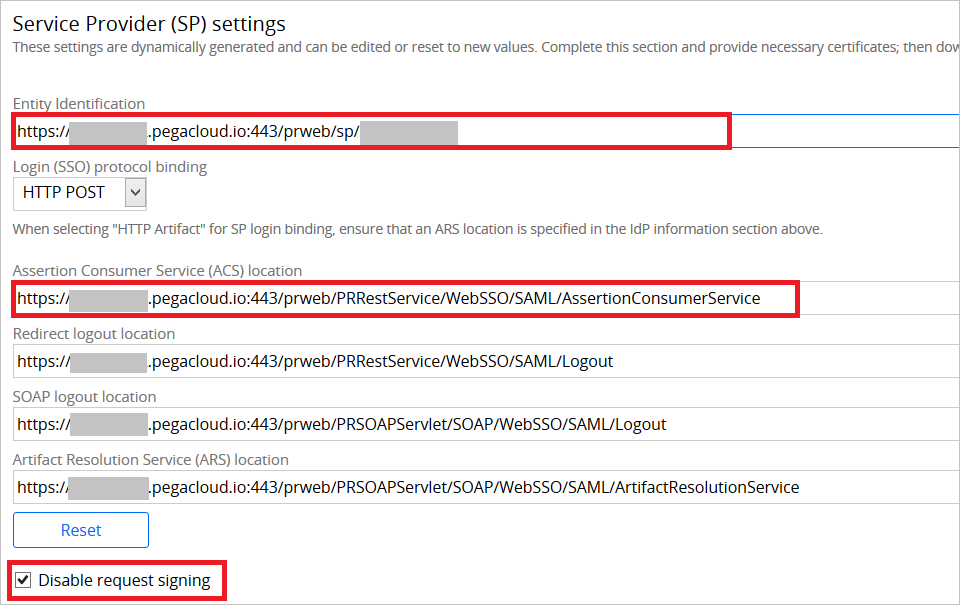

## Prerequisites

To configure Azure AD integration with Pega Systems, you need the following items:

- An Azure AD subscription
- A Pega Systems single sign-on enabled subscription

> **Note:**
> To test the steps in this tutorial, we do not recommend using a production environment.

To test the steps in this tutorial, you should follow these recommendations:

- Do not use your production environment, unless it is necessary.
- If you don't have an Azure AD trial environment, you can [get a one-month trial](https://azure.microsoft.com/pricing/free-trial/).

### Configuring Pega Systems for single sign-on

1. To configure single sign-on on **Pega Systems** side, open the **Pega Portal** with admin account in another browser window.

2. Select **Create** -> **SysAdmin** -> **Authentication Service**.

	
	
3. Perform following actions on **Create Aauthentication Service** screen:

	

	a. Select **SAML 2.0** from Type

	b. In the **Name** textbox, enter any name e.g Azure AD SSO

	c. In the **Short Description** textbox, enter any description  

	d. Click on **Create and open** 
	
4. In **Identity Provider (IdP) information** section, click on **Import IdP metadata** and browse the metadata file which you have **[Downloaded SAML Metadata file](%metadata:metadataDownloadUrl%)** from the Azure portal. Click **Submit** to load the metadata.

	
	
5. This will populate the IdP data as shown below.

	
	
6. Perform following actions on **Service Provider (SP) settings** section:

	

	a. Copy the **Entity Identification** value and paste back in Azure Portal's **Identifier** textbox.

	b.  Copy the **Assertion Consumer Service (ACS) location** value and paste back in Azure Portal's **Reply URL** textbox.

	c. Select **Disable request signing**.

7. Click **Save**

## Quick Reference

* **[Download SAML Metadata file](%metadata:metadataDownloadUrl%)**

## Additional Resources

* [How to integrate Pega Systems with Azure Active Directory](https://docs.microsoft.com/azure/active-directory/active-directory-saas-pegasystems-tutorial)
