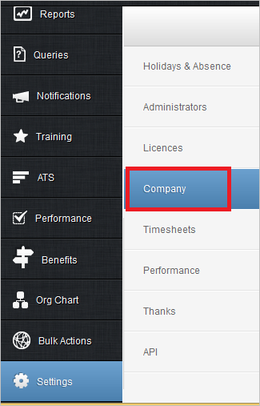

## Prerequisites

To configure Azure AD integration with People, you need the following items:

- An Azure AD subscription
- A People single sign-on enabled subscription

> **Note:**
> To test the steps in this tutorial, we do not recommend using a production environment.

To test the steps in this tutorial, you should follow these recommendations:

- Do not use your production environment, unless it is necessary.
- If you don't have an Azure AD trial environment, you can get a one-month trial [here](https://azure.microsoft.com/pricing/free-trial/).

### Configuring People for single sign-on

1. To get SSO configured for your application, you need to sign-on to your People tenant as an administrator.
   
2. In the menu on the left side, click **Settings**.

	

3. Click **Company**.

	

4. On the **Upload 'Single Sign On' SAML meta-data file**, click **Browse** to upload the **[Downloaded SAML Metadata file](%metadata:metadataDownloadUrl%)**.

	

## Quick Reference

* **[Download SAML Metadata file](%metadata:metadataDownloadUrl%)**

## Additional Resources

* [How to integrate People with Azure Active Directory](https://docs.microsoft.com/azure/active-directory/active-directory-saas-people-tutorial)
