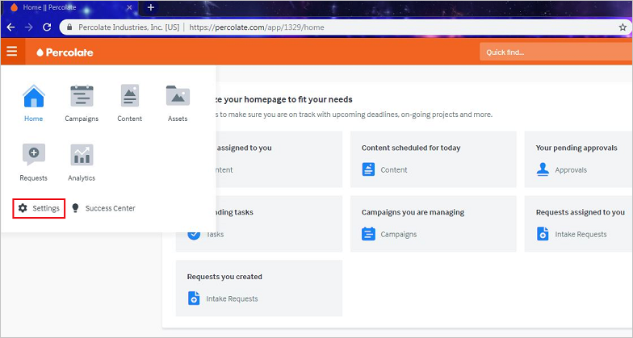

## Prerequisites

To configure Azure AD integration with Percolate, you need the following items:

- An Azure AD subscription
- A Percolate single sign-on enabled subscription

> **Note:**
> To test the steps in this tutorial, we do not recommend using a production environment.

To test the steps in this tutorial, you should follow these recommendations:

- Do not use your production environment, unless it is necessary.
- If you don't have an Azure AD environment, you can get a [free account](https://azure.microsoft.com/free/).

### Configuring Percolate for single sign-on

1. In a different web browser window, sign in to Percolate as an Administrator.

2. On the left of the home page, click on **Settings**.
	
	

3. From the left side of menubar, click on **SSO** under **Organization**.

	

	a. In the **Login URL** textbox, paste the value of **Azure AD Login URL** : %metadata:singleSignOnServiceUrl% which you have copied from Azure portal.

	b. In the **Entity ID** textbox, paste the value of **Azure AD Identifier** which you have copied from Azure portal.

	c. In Notepad, open the **[Downloaded Azure AD Signing Certifcate](%metadata:CertificateDownloadRawUrl%)** from the Azure portal, copy its content, and then paste it into the **x509 certificates** box.

	d. In the **Email attribute** textbox, type **emailaddress**.

	e. **Identity provider metadata URL** field is optional and if you have **App federation Metadata url** which you have copied from Azure portal, paste it in the **Identity provider metadata URL** textbox.

	f. Select **No** as **Should AuthNRequests be signed?**.

	g. Select **No** as **Enable SSO auto-Provisioning**.

	h. Click **Save**.

## Quick Reference

* **Azure AD Login URL** : %metadata:singleSignOnServiceUrl%

* **[Download Azure AD Signing Certifcate](%metadata:CertificateDownloadRawUrl%)**

* **[Download SAML Metadata file](%metadata:metadataDownloadUrl%)**

## Additional Resources

* [How to integrate Percolate with Azure Active Directory](https://docs.microsoft.com/azure/active-directory/saas-apps/percolate-tutorial)
