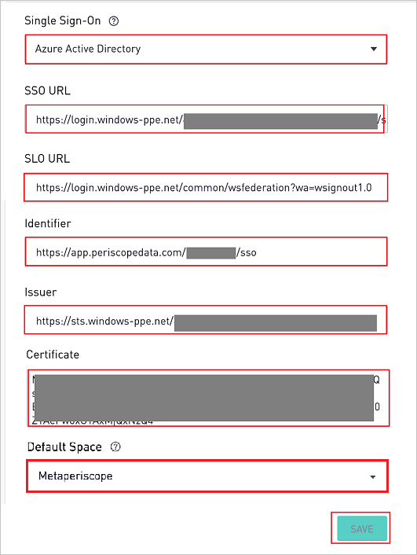
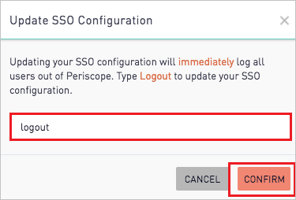

## Prerequisites

To configure Azure AD integration with Periscope Data, you need the following items:

- An Azure AD subscription
- A Periscope Data single sign-on enabled subscription

> **Note:**
> To test the steps in this tutorial, we do not recommend using a production environment.

To test the steps in this tutorial, you should follow these recommendations:

- Do not use your production environment, unless it is necessary.
- If you don't have an Azure AD trial environment, you can [get a one-month trial](https://azure.microsoft.com/pricing/free-trial/).

### Configuring Periscope Data for single sign-on

1. In a different web browser window, sign in to Periscope Data as an Administrator.

2. Open the gear menu in the bottom left and open the **Billing** > **Security** menu and perform the following steps. Only admins have access to these settings.

    

    a. Copy the **App Federation Metadata URL** from step #5 **SAML Signing Certificate** and open it in a browser. This will open up an XML document.

    b. In the **Single Sign-On** textbox, select **Azure Active Directory**.

    c. Find the tag **SingleSignOnService** and paste the **Location** value in the **SSO URL** textbox.

    d. Find the tag **SingleLogoutService** and paste the **Location** value in the **SLO URL** textbox.

    e. Copy the **Identifier** value for your instance and paste it in **Identifier (Entity ID)** textbox of **Basic SAML Configuration** section on Azure portal.

    f. The first tag of the XML file, copy the value of **entityID** and paste it in the **Issuer** textbox.

    g. Find the tag **IDPSSODescriptor** with SAML protocol. Within that section, find the tag **KeyDescriptor** with **use=signing**. copy the value of **X509Certificate** and paste it in the **Certificate** textbox.

    h. Sites with multiple spaces can choose the default space from the **Default Space** drop down. This will be the space new users get added to when they log in to Periscope Data for the first time and are provisioned through the Active Directory Single Sign On.

    i. Finally, click **Save** and **confirm** the SSO settings change by typing **Logout**.

    

## Quick Reference

* **Azure AD Single Sign-On Service URL** : %metadata:singleSignOnServiceUrl%

* **[Download Azure AD Signing Certifcate](%metadata:CertificateDownloadRawUrl%)**

* **[Download SAML Metadata file](%metadata:metadataDownloadUrl%)**

## Additional Resources

* [How to integrate Periscope Data with Azure Active Directory](https://docs.microsoft.com/azure/active-directory/saas-apps/periscope-data-tutorial)
