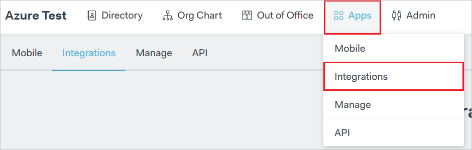
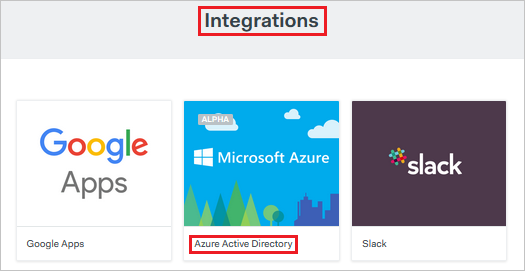
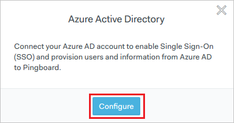
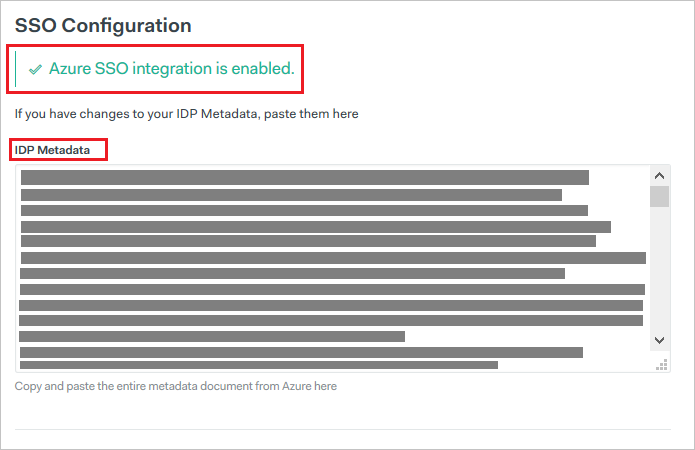

## Prerequisites

To configure Azure AD integration with Pingboard, you need the following items:

- An Azure AD subscription
- A Pingboard single-sign on enabled subscription

> **Note:**
> To test the steps in this tutorial, we do not recommend using a production environment.

To test the steps in this tutorial, you should follow these recommendations:

- Do not use your production environment, unless it is necessary.
- If you don't have an Azure AD trial environment, you can get a one-month trial [here](https://azure.microsoft.com/pricing/free-trial/).

### Configuring Pingboard for single sign-on

1. To configure SSO on Pingboard side, open a new browser window and log in to your Pingboard Account. You must be a Pingboard admin to set up single sign-on.

2. From the top menu, select **Apps > Integrations**

	

3.	On the **Integrations** page, find the **"Azure Active Directory"** tile, and click it.

	

4. In the modal that follows click **"Configure"**

	

5. On the following page, you notice that "Azure SSO Integration is enabled." Open the **[Download SAML Metadata file](%metadata:metadataDownloadUrl%)** in a notepad and paste the content in **IDP Metadata**.

	

6. The file will be validated, and if everything is correct, single sign-on will now be enabled

## Quick Reference

* **[Download SAML Metadata file](%metadata:metadataDownloadUrl%)**

## Additional Resources

* [How to integrate Pinboard with Azure Active Directory](active-directory-saas-pingboard-tutorial.md)

