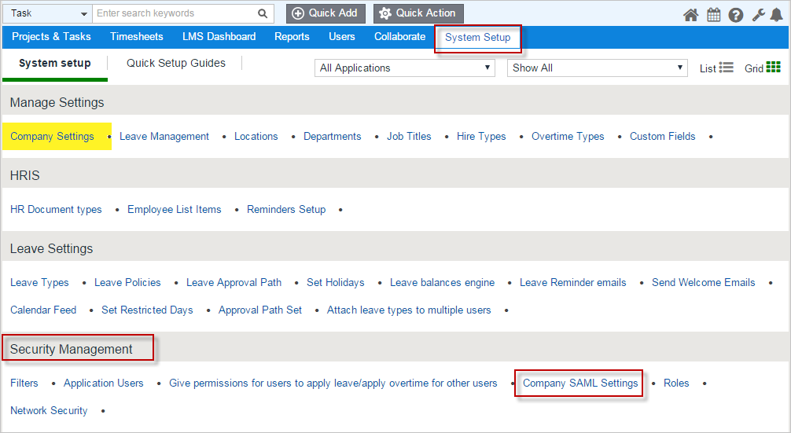
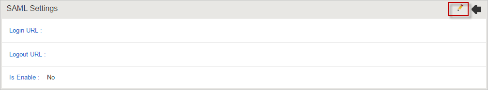
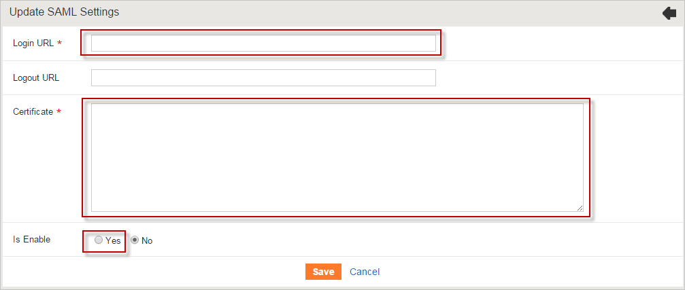

## Prerequisites

To configure Azure AD integration with PlanMyLeave, you need the following items:

- An Azure AD subscription
- A PlanMyLeave single sign-on enabled subscription

> **Note:**
> To test the steps in this tutorial, we do not recommend using a production environment.

To test the steps in this tutorial, you should follow these recommendations:

- Do not use your production environment, unless it is necessary.
- If you don't have an Azure AD trial environment, you can get a one-month trial [here](https://azure.microsoft.com/pricing/free-trial/).

### Configuring PlanMyLeave for single sign-on

1. In a different web browser window, log into your PlanMyLeave tenant as an administrator.

2. Go to **System Setup**. Then on the **Security Management** section click **Company SAML settings** .

	 

3. On the **SAML Settings** section, click editor icon.

	

4. On the **Update SAML Settings** section, perform the following steps:

	

	a.  In the **Login URL** textbox, enter Azure AD Single Sign-On Service URL** : %metadata:singleSignOnServiceUrl%.

    b.  Open your downloaded [metadata](%metadata:metadataDownloadUrl%), copy  **X509Certificate** value and then paste it to the **Certificate** textbox.

	c. Set "**Is Enable**" to "**Yes**".

	d. Click **Save**. 

## Quick Reference

* **Azure AD Single Sign-On Service URL** : %metadata:singleSignOnServiceUrl%

* **[Download SAML Metadata file](%metadata:metadataDownloadUrl%)**

## Additional Resources

* [How to integrate PlanMyLeave with Azure Active Directory](https://docs.microsoft.com/azure/active-directory/active-directory-saas-planmyleave-tutorial)
