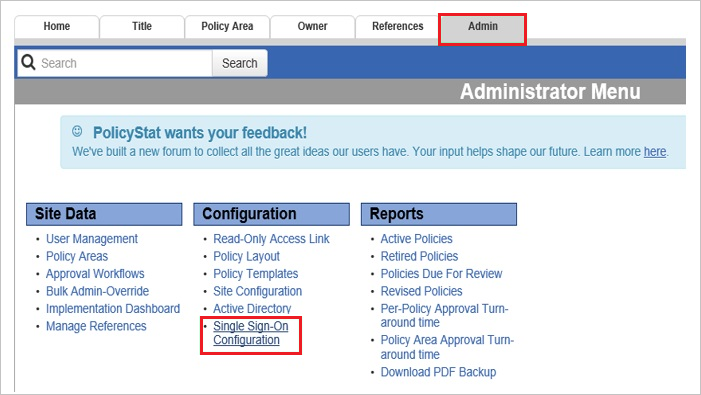
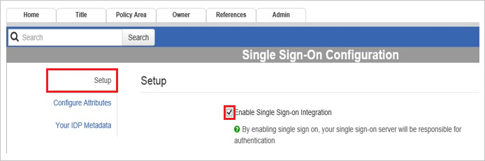
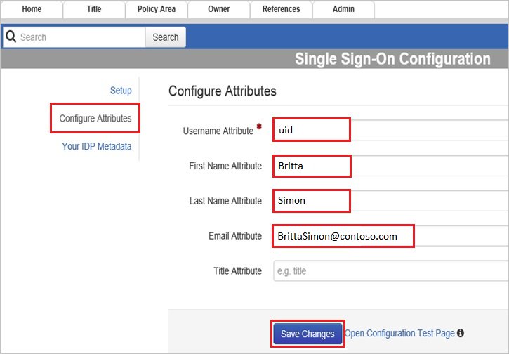
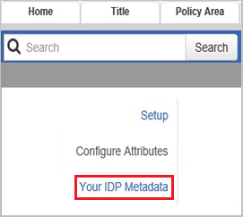

## Prerequisites

To configure Azure AD integration with PolicyStat, you need the following items:

- An Azure AD subscription
- A PolicyStat single sign-on enabled subscription

> **Note:**
> To test the steps in this tutorial, we do not recommend using a production environment.

To test the steps in this tutorial, you should follow these recommendations:

- Do not use your production environment, unless it is necessary.
- If you don't have an Azure AD trial environment, you can get a one-month trial here: [Trial offer](https://azure.microsoft.com/pricing/free-trial/).

### Configuring PolicyStat for single sign-on

1. In a different web browser window, log into your PolicyStat company site as an administrator.

2. Click the **Admin** tab, and then click **Single Sign-On Configuration** in left navigation pane.
   
    

3. In the **Setup** section, select **Enable Single Sign-on Integration**.
   
    

4. Click **Configure Attributes**, and then, in the **Configure Attributes** section, perform the following steps:
   
    
   
    a. In the **Username Attribute** textbox, type **uid**.

    b. In the **First Name Attribute** textbox, type **firstname** of user **Britta**.

    c. In the **Last Name Attribute** textbox, type **lastname** of user **Simon**.

    d. In the **Email Attribute** textbox, type **emailaddress** of user **BrittaSimon@contoso.com**.

    e. Click **Save Changes**.

5. Click **Your IDP Metadata**, and then, in the **Your IDP Metadata** section, perform the following steps:
   
    
   
    a. Open your **[Downloaded SAML Metadata file](%metadata:metadataDownloadUrl%)**, copy the content, and  then paste it into the **Your Identity Provider Metadata** textbox.

    b. Click **Save Changes**.

## Quick Reference

* **[Download SAML Metadata file](%metadata:metadataDownloadUrl%)**

## Additional Resources

* [How to integrate PolicyStat with Azure Active Directory](https://docs.microsoft.com/azure/active-directory/active-directory-saas-policystat-tutorial)
