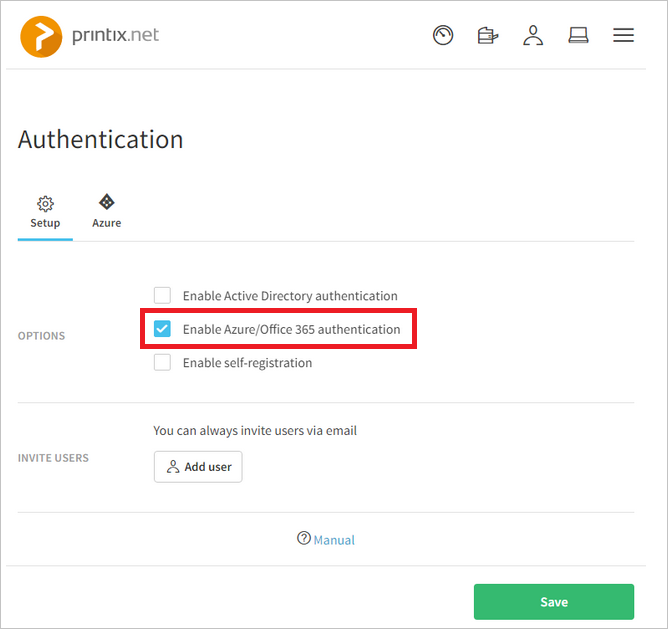

## Prerequisites

To configure Azure AD integration with Printix, you need the following items:

- An Azure AD subscription
- A Printix single sign-on enabled subscription

> **Note:**
> To test the steps in this tutorial, we do not recommend using a production environment.

To test the steps in this tutorial, you should follow these recommendations:

- Do not use your production environment, unless it is necessary.
- If you don't have an Azure AD trial environment, you can get a one-month trial [here](https://azure.microsoft.com/pricing/free-trial/).

### Configuring Printix for single sign-on

1. Sign-on to your Printix tenant as an administrator.

2. In the menu on the top, click the icon at the upper right corner and select "**Authentication**".
   
    

3. On the **Setup** tab, select **Enable Azure/Office 365 authentication**
   
    

4. On the **Azure** tab, input federation metadata URL to the textbox of "**Federation metadata document**". 

    Attach the **[Downloaded SAML Metadata file](%metadata:metadataDownloadUrl%)** from Azure AD to [Printix support team](mailto:support@printix.net). Then they upload the xml file and provide a federation metadata URL.
   
    
   
5. Click the "**Test**" button and click "**OK**" button if the test was successful.
   
     Azure active directory page will show after clicking the **test** button. "The test was successful" here means after entering the credentials of your Azure test account it will pop up a message "Settings tested OK".Then click the **OK** button.
   
    

6. Click the **Save** button on "**Authentication**" page.

## Quick Reference

* **[Download SAML Metadata file](%metadata:metadataDownloadUrl%)**

## Additional Resources

* [How to integrate Printix with Azure Active Directory](https://docs.microsoft.com/azure/active-directory/active-directory-saas-printix-tutorial)
