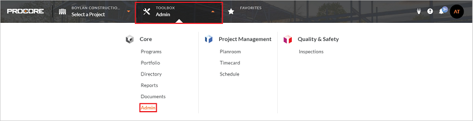
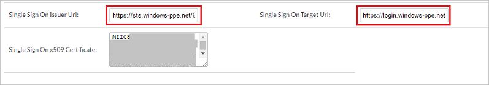

## Prerequisites

To configure Azure AD integration with Procore SSO, you need the following items:

- An Azure AD subscription
- A Procore SSO single-sign on enabled subscription

> **Note:**
> To test the steps in this tutorial, we do not recommend using a production environment.

To test the steps in this tutorial, you should follow these recommendations:

- Do not use your production environment, unless it is necessary.
- If you don't have an Azure AD trial environment, you can get a one-month trial [here](https://azure.microsoft.com/pricing/free-trial/).

### Configuring Procore SSO for single sign-on

1. To configure single sign-on on **Procore SSO** side, login to your procore company site as an administrator.

2. From the toolbox drop-down, click **Admin** to open the SSO settings page.

	

3. Paste the values in the boxes as described below-

		

	a. In the **Single Sign On Issuer URL** box, paste the **Azure AD SAML Entity ID** : %metadata:IssuerUri% copied from the Azure portal.

	b. In the **SAML Sign On Target URL** box, paste the **Azure AD Single Sign-On Service URL** : %metadata:singleSignOnServiceUrl% copied from the Azure portal.

	c. Now open the **[Download SAML Metadata file](%metadata:metadataDownloadUrl%)** above from the Azure portal and copy the certificate in the tag named **X509Certificate**. Paste the copied value into the **Single Sign On x509 Certificate** box.

4. Click **Save Changes**.

5. After these settings, you need to send the **domain name** (e.g **contoso.com**) through which you are logging in to Procore to the [Procore Support team](https://support.procore.com/) and they will activate federated SSO for that domain.

## Quick Reference

* **Azure AD Single Sign-On Service URL** : %metadata:singleSignOnServiceUrl%

* **Azure AD SAML Entity ID** : %metadata:IssuerUri%

* **[Download SAML Metadata file](%metadata:metadataDownloadUrl%)**

## Additional Resources

* [How to integrate Procore SSO with Azure Active Directory](active-directory-saas-procoresso-tutorial.md)
* [How to configure user provisioning with Procore SSO](active-directory-saas-procoresso-user-provisioning-tutorial.md)
