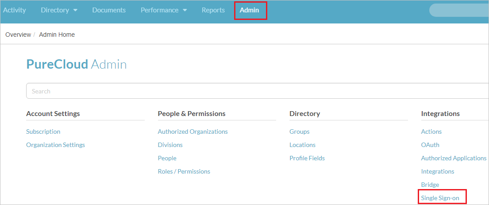
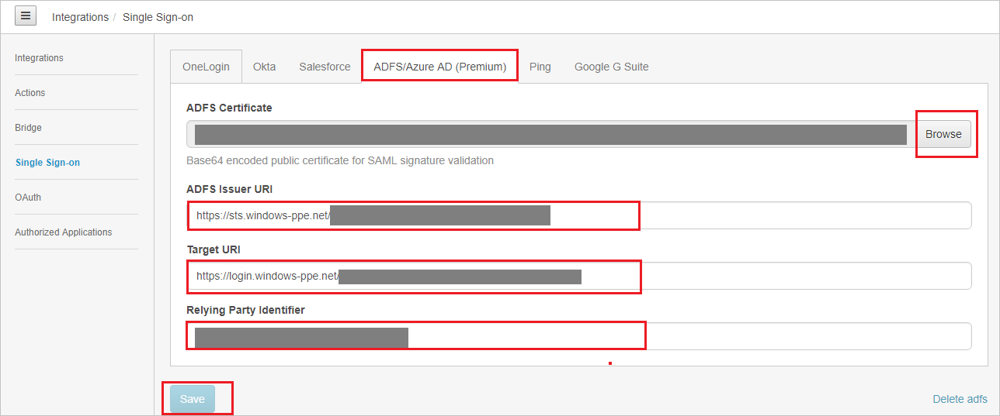
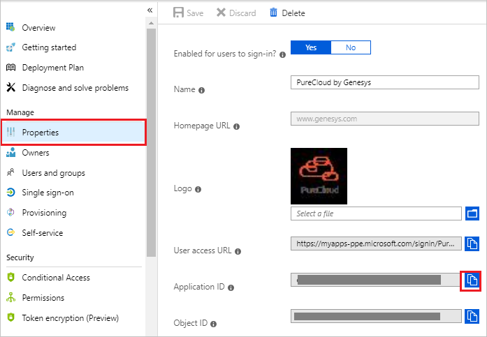

## Prerequisites

To configure Azure AD integration with PureCloud by Genesys, you need the following items:

- An Azure AD subscription
- A PureCloud by Genesys single sign-on enabled subscription

> **Note:**
> To test the steps in this tutorial, we do not recommend using a production environment.

To test the steps in this tutorial, you should follow these recommendations:

- Do not use your production environment, unless it is necessary.
- If you don't have an Azure AD trial environment, you can [get a one-month trial](https://azure.microsoft.com/pricing/free-trial/).

### Configuring PureCloud by Genesys for single sign-on

1. In a different web browser window, login to PureCloud by Genesys as an Administrator.

2. Click on **Admin** on the top and navigate to **Single Sign-on** under **Integrations**.

	

3. Switch to **ADFS/Azure AD(Premium)** tab, and perform the following steps:

	

	a. Click **Browse** to upload the **[Downloaded Azure AD Signing Certifcate (Base64 encoded)](%metadata:certificateDownloadBase64Url%)** from the Azure portal, into the **ADFS Certificate**.

	b. In the **ADFS Issuer URI** textbox, paste the value of **Azure AD Identifier** which you have copied from the Azure portal.

	c. In the **Target URI** textbox, paste the value of **Login URL** : %metadata:singleSignOnServiceUrl% which you have copied from the Azure portal.

	d. For **Relying Party Identifier** value, you need to go to the Azure portal, on the **PureCloud by Genesys** application integration page, click on **Properties** tab and copy the **Application ID** value. Paste it in the **Relying Party Identifier** textbox. 

	

	e. Click **Save**

## Quick Reference

* **Azure AD Login URL** : %metadata:singleSignOnServiceUrl%

* **[Download Azure AD Signing Certifcate (Base64 encoded)](%metadata:certificateDownloadBase64Url%)**

## Additional Resources

* [How to integrate PureCloud by Genesys with Azure Active Directory](https://docs.microsoft.com/azure/active-directory/saas-apps/purecloud-by-genesys-tutorial)
