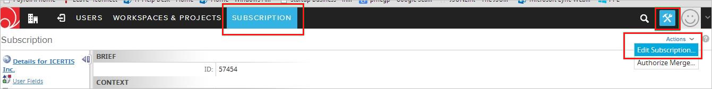
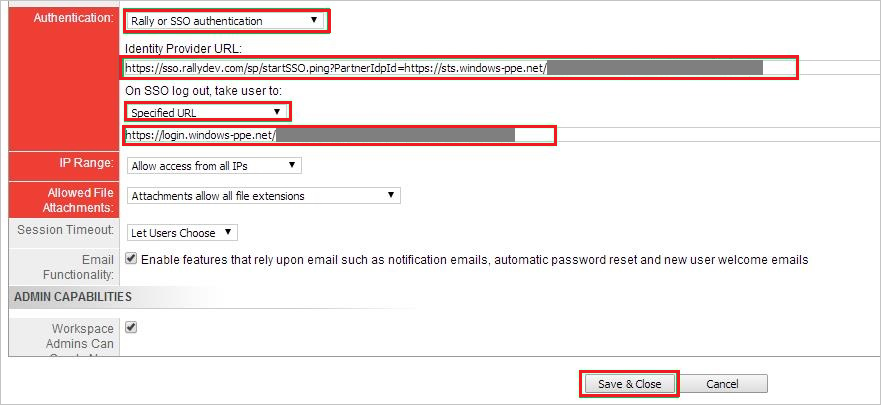

## Prerequisites

To configure Azure AD integration with Rally Software, you need the following items:

- An Azure AD subscription
- A Rally Software single-sign on enabled subscription

> **Note:**
> To test the steps in this tutorial, we do not recommend using a production environment.

To test the steps in this tutorial, you should follow these recommendations:

- Do not use your production environment, unless it is necessary.
- If you don't have an Azure AD trial environment, you can get a one-month trial [here](https://azure.microsoft.com/pricing/free-trial/).

### Configuring Rally Software for single sign-on

1. Log in to your **Rally Software** tenant.

2. In the toolbar on the top, click **Setup**, and then select **Subscription**.
   
    

3. Click the **Action** button. Select **Edit Subscription** at the top right side of the toolbar.

4. On the **Subscription** dialog page, perform the following steps, and then click **Save & Close**:
   
    
   
    a. Select **Rally or SSO authentication** from Authentication dropdown.

    b. In the **Identity provider URL** textbox, paste the value of **Azure AD SAML Entity ID** : %metadata:IssuerUri% which you have copied from the Azure portal.

    c. In the **SSO Logout** textbox, Paste the value of **Azure AD Sign Out URL** : %metadata:singleSignOutServiceUrl% which you have copied from the Azure portal.

## Quick Reference

* **Azure AD Sign Out URL** : %metadata:singleSignOutServiceUrl%

* **Azure AD SAML Entity ID** : %metadata:IssuerUri%

* **[Download SAML Metadata file](%metadata:metadataDownloadUrl%)**

## Additional Resources

* [How to integrate Rally Software with Azure Active Directory](https://docs.microsoft.com/azure/active-directory/active-directory-saas-rally-software-tutorial)
