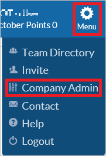
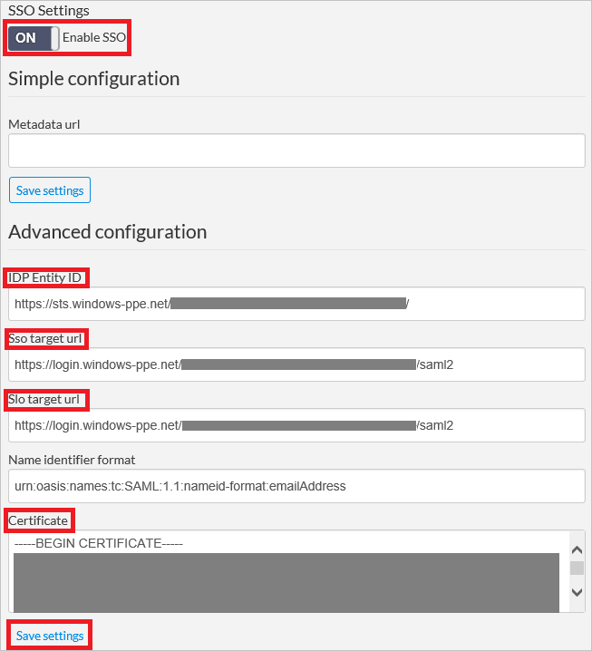
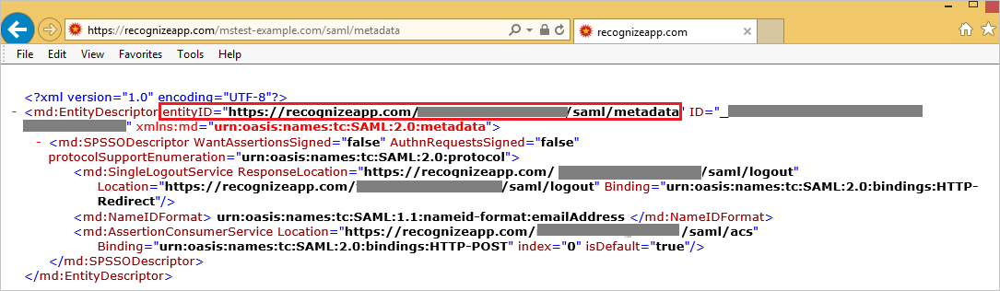

## Prerequisites

To configure Azure AD integration with Recognize, you need the following items:

- An Azure AD subscription
- A Recognize single sign-on enabled subscription

> **Note:**
> To test the steps in this tutorial, we do not recommend using a production environment.

To test the steps in this tutorial, you should follow these recommendations:

- Do not use your production environment, unless it is necessary.
- If you don't have an Azure AD trial environment, you can get a one-month trial here: [Trial offer](https://azure.microsoft.com/pricing/free-trial/).

### Configuring Recognize for single sign-on

1. In a different web browser window, sign-on to your Recognize tenant as an administrator.

2. On the upper right corner, click **Menu**. Go to **Company Admin**.
   
    

3. On the left navigation pane, click **Settings**.
   
    

4. Perform the following steps on **SSO Settings** section.
   
    
	
	a. As **Enable SSO**, select **ON**.

	b. In the **IDP Entity ID** textbox, paste the value of **Azure AD SAML Entity ID** : %metadata:IssuerUri% which you have copied from Azure portal.
	
	c. In the **Sso target url** textbox, paste the value of **Azure AD Single Sign-On Service URL** : %metadata:singleSignOnServiceUrl% which you have copied from Azure portal.
	
	d. In the **Slo target url** textbox, paste the value of **Azure AD Sign Out URL** : %metadata:singleSignOutServiceUrl% which you have copied from Azure portal. 
	
	e. Open your **[Downloaded Azure AD Signing Certificate (Base64 encoded)](%metadata:certificateDownloadBase64Url%)** in notepad, copy the content of it into your clipboard, and then paste it to the **Certificate** textbox.
	
	f. Click the **Save settings** button. 

5. Beside the **SSO Settings** section, copy the URL under **Service Provider Metadata url**.
   
    

6. Open the **Metadata URL link** under a blank browser to download the metadata document. Then copy the EntityDescriptor value(entityID) from the file and paste it in **Identifier** textbox in **Recognize Domain and URLs section** on Azure portal.
    
    

## Quick Reference

* **Azure AD Single Sign-On Service URL** : %metadata:singleSignOnServiceUrl%

* **Azure AD Sign Out URL** : %metadata:singleSignOutServiceUrl%

* **Azure AD SAML Entity ID** : %metadata:IssuerUri%

* **[Download Azure AD Signing Certificate (Base64 encoded)](%metadata:certificateDownloadBase64Url%)**

## Additional Resources

* [How to integrate Recognize with Azure Active Directory](https://docs.microsoft.com/azure/active-directory/active-directory-saas-recognize-tutorial)
