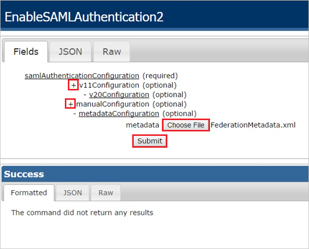

## Prerequisites

To configure Azure AD integration with Replicon, you need the following items:

- An Azure AD subscription
- A Replicon single sign-on enabled subscription

> **Note:**
> To test the steps in this tutorial, we do not recommend using a production environment.

To test the steps in this tutorial, you should follow these recommendations:

- Do not use your production environment, unless it is necessary.
- If you don't have an Azure AD trial environment, you can [get a one-month trial](https://azure.microsoft.com/pricing/free-trial/).

### Configuring Replicon for single sign-on

1. In a different web browser window, log into your Replicon company site as an administrator.

2. To configure SAML 2.0, perform the following steps:
   
    
	
	a. To display the **EnableSAML Authentication2** dialog, append the following to your URL, after your company key: `/services/SecurityService1.svc/help/test/EnableSAMLAuthentication2`
	
	* The following shows the schema of the complete URL:  
   `https://na2.replicon.com/\<YourCompanyKey\>/services/SecurityService1.svc/help/test/EnableSAMLAuthentication2`
   
   b. Click the **+** to expand the **v20Configuration** section.

   c. Click the **+** to expand the **metaDataConfiguration** section.

   d. Click **Choose File**, to select your **[Downloaded SAML Metadata file](%metadata:metadataDownloadUrl%)**, and click **Submit**.

## Quick Reference

* **[Download SAML Metadata file](%metadata:metadataDownloadUrl%)**

## Additional Resources

* [How to integrate Replicon with Azure Active Directory](https://docs.microsoft.com/azure/active-directory/active-directory-saas-replicon-tutorial)
