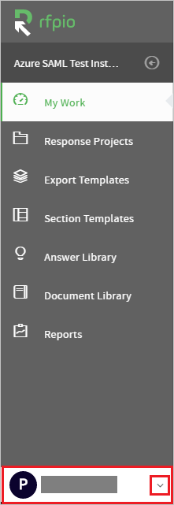
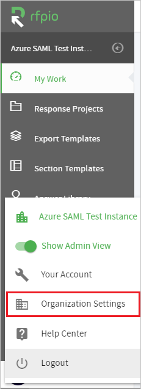
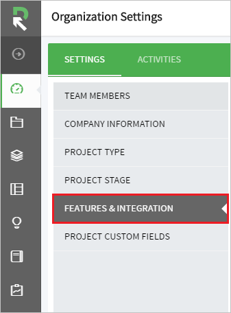
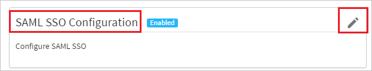
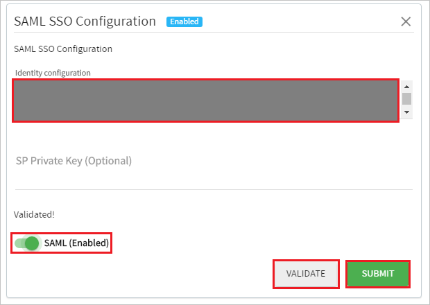

## Prerequisites

To configure Azure AD integration with RFPIO, you need the following items:

- An Azure AD subscription
- A RFPIO single sign-on enabled subscription

> **Note:**
> To test the steps in this tutorial, we do not recommend using a production environment.

To test the steps in this tutorial, you should follow these recommendations:

- Do not use your production environment, unless it is necessary.
- If you don't have an Azure AD trial environment, you can [get a one-month trial](https://azure.microsoft.com/pricing/free-trial/).

### Configuring RFPIO for single sign-on

1. In a different web browser window, login to the **RFPIO** website as an administrator.

2. Click on the bottom left corner dropdown.

	

3. Click on the **Organization Settings**. 

	

4. Click on the **FEATURES & INTEGRATION**.

	

5. In the **SAML SSO Configuration** Click **Edit**.

	

6. In this Section perform following actions:

	
	
	a. Copy the content of the **[Downloaded SAML Metadata file](%metadata:metadataDownloadUrl%)** and paste it into the **identity configuration** field.

	> [!NOTE]
	>To copy the content of downloaded **Metadata XML** Use **Notepad++** or proper **XML Editor**. 

	b. Click **Validate**.

	c. After Clicking **Validate**, Flip **SAML(Enabled)** to on.

	d. Click **Submit**.

## Quick Reference

* **[Download Azure AD Signing Certifcate](%metadata:CertificateDownloadRawUrl%)**

* **[Download SAML Metadata file](%metadata:metadataDownloadUrl%)**

## Additional Resources

* [How to integrate RFPIO with Azure Active Directory](https://docs.microsoft.com/en-us/azure/active-directory/active-directory-saas-rfpio-tutorial)
