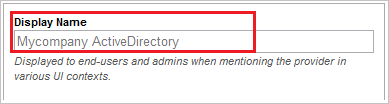

## Prerequisites

To configure Azure AD integration with Rightscale, you need the following items:

- An Azure AD subscription
- A Rightscale single sign-on enabled subscription

> **Note:**
> To test the steps in this tutorial, we do not recommend using a production environment.

To test the steps in this tutorial, you should follow these recommendations:

- Do not use your production environment, unless it is necessary.
- If you don't have an Azure AD trial environment, you can get a one-month trial [here](https://azure.microsoft.com/pricing/free-trial/).

### Configuring Rightscale for single sign-on

1. To get SSO configured for your application, you need to sign-on to your RightScale tenant as an administrator.

    a. In the menu on the top, click the **Settings** tab and select **Single Sign-On**.
   
     

    b. Click the "**new**" button to add **Your SAML Identity Providers**.
   
     
 
    c. In the textbox of **Display Name**, input your company name.
   
    
 
    d. Select **Allow RightScale-initiated SSO using a discovery hint** and input your **domain name** in the below textbox.
   
    

    e. Paste the value of **Azure AD Single Sign-On Service URL** : %metadata:singleSignOnServiceUrl% which you have copied from Azure portal into **SAML SSO Endpoint** in RightScale.
   
    

    f. Paste the value of **Azure AD SAML Entity ID** : %metadata:IssuerUri% which you have copied from Azure portal into **SAML EntityID** in RightScale.
   
    

    g. Click **Browser** button to upload the **[Downloaded Azure AD Signing Certifcate (Base64 encoded)](%metadata:certificateDownloadBase64Url%)** from Azure portal.
   
    

    h. Click **Save**.

## Quick Reference

* **Azure AD Single Sign-On Service URL** : %metadata:singleSignOnServiceUrl%

* **Azure AD SAML Entity ID** : %metadata:IssuerUri%

* **[Download Azure AD Signing Certifcate (Base64 encoded)](%metadata:certificateDownloadBase64Url%)**

## Additional Resources

* [How to integrate Rightscale with Azure Active Directory](https://docs.microsoft.com/azure/active-directory/active-directory-saas-rightscale-tutorial)
