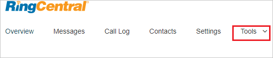
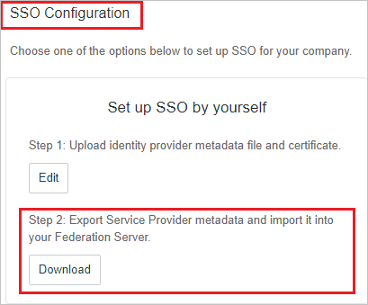

## Prerequisites

To configure Azure AD integration with RingCentral, you need the following items:

- An Azure AD subscription
- A RingCentral single sign-on enabled subscription

> **Note:**
> To test the steps in this tutorial, we do not recommend using a production environment.

To test the steps in this tutorial, you should follow these recommendations:

- Do not use your production environment, unless it is necessary.
- If you don't have an Azure AD trial environment, you can [get a one-month trial](https://azure.microsoft.com/pricing/free-trial/).

### Configuring RingCentral for single sign-on

8. In a different web browser window, login to RingCentral as a Security Administrator.

9. On the top, click on **Tools**.

	

10. Navigate to **Single Sign-on**.

	

11. On the **Single Sign-on** page, under **SSO Configuration** section, from **Step 1** click **Edit** and perform the following steps:

	

12. On the **Set up Single Sign-on** page, perform the following steps:

	

	a. Click **Browse** to upload the **[Downloaded SAML Metadata file](%metadata:metadataDownloadUrl%)** from Azure portal.

	b. After uploading metadata the values get auto-populated in **SSO General Information** section.

	c. Under **Attribute Mapping** section, select **Map Email Attribute to** as `http://schemas.xmlsoap.org/ws/2005/05/identity/claims/emailaddress`

	d. Click **Save**.

	e. From **Step 2** click **Download** to download the **Service Provider metadata file** and upload it in **Basic SAML Configuration** section to auto polulate the **Identifier** and **Reply URL** values in Azure portal.

	 

	f. On the same page, navigate to **Enable SSO** section and perform the following steps:

	

	a. Select **Enable SSO Service**.
	
	b. Select **Allow users to log in with SSO or RingCentral credential**.

	c. Click **Save**.

## Quick Reference

* **Azure AD Single Sign-On Service URL** : %metadata:singleSignOnServiceUrl%

* **[Download Azure AD Signing Certifcate](%metadata:CertificateDownloadRawUrl%)**

* **[Download SAML Metadata file](%metadata:metadataDownloadUrl%)**

## Additional Resources

* [How to integrate RingCentral with Azure Active Directory](https://docs.microsoft.com/azure/active-directory/saas-apps/ringcentral-tutorial)
