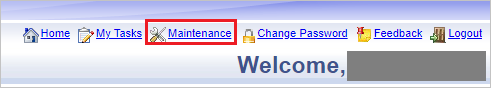
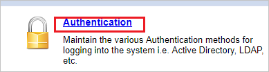
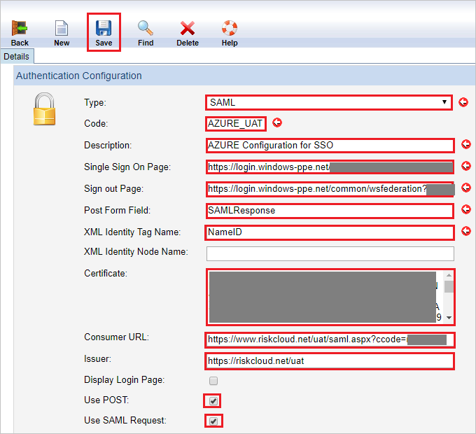

## Prerequisites

To configure Azure AD integration with Riskware, you need the following items:

- An Azure AD subscription
- A Riskware single sign-on enabled subscription

> **Note:**
> To test the steps in this tutorial, we do not recommend using a production environment.

To test the steps in this tutorial, you should follow these recommendations:

- Do not use your production environment, unless it is necessary.
- If you don't have an Azure AD trial environment, you can [get a one-month trial](https://azure.microsoft.com/pricing/free-trial/).

### Configuring Riskware for single sign-on

1. In a different web browser window, log in to your Riskware company site as an administrator.

2. On the top right, click **Maintenance** to open the maintenance page. 

	

3. In the maintenance page, click **Authentication**.

	

4. In **Authentication Configuration** page, perform the following steps:

	

	a. Select **Type** as **SAML** for authentication.

	b. In the **Code** textbox, type your code like AZURE_UAT.

	c. In the **Description** textbox, type your description like AZURE Configuration for SSO.

	d. In **Single Sign On Page** textbox, paste the value of **SAML Single Sign-On Service URL**, which you have copied from Azure portal.

	e. In **Sign out Page** textbox, paste the value of **Sign-Out URL**, which you have copied from Azure portal.

	f. In the **Post Form Field** textbox, type the field name present in Post Response that contains SAML like SamlResponse

	g. In the **XML Identity Tag Name** textbox, type attribute, which contains the unique identifier in the SAML response like NameID.

	h. Open the **[Downloaded SAML Metadata file](%metadata:metadataDownloadUrl%)** from Azure portal in notepad, copy the certificate from the Metadata file and paste it into the **Certificate** textbox
	
	i. In **Consumer URL** textbox, paste the value of **Reply URL**, which you get from the support team.

	j. In **Issuer** textbox, paste the value of **Identifier**, which you get from the support team.

	> [!Note]
	> Contact [Riskware Client support team](mailto:support@pansoftware.com.au) to get these values

	k. Select **Use POST** to pass SAML Request as a post parameter.

	l. Select **Use SAML Request** to pass SSO allow SAML Request for SP initiated.

	m. Click **Save**.

## Quick Reference

* **[Download Azure AD Signing Certifcate](%metadata:CertificateDownloadRawUrl%)**

* **[Download SAML Metadata file](%metadata:metadataDownloadUrl%)**

## Additional Resources

* [How to integrate Riskware with Azure Active Directory](https://docs.microsoft.com/azure/active-directory/active-directory-saas-riskware-tutorial)
