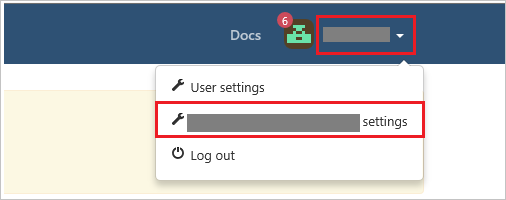
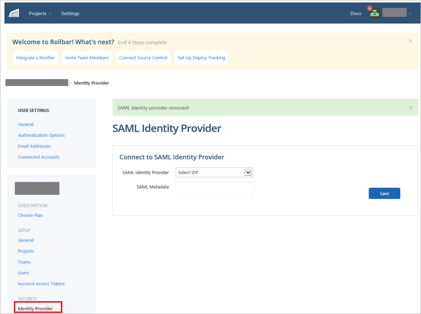
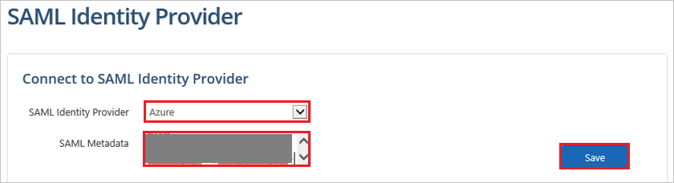
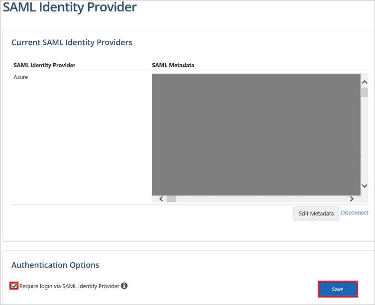

## Prerequisites

To configure Azure AD integration with Rollbar, you need the following items:

- An Azure AD subscription
- A Rollbar single sign-on enabled subscription

> **Note:**
> To test the steps in this tutorial, we do not recommend using a production environment.

To test the steps in this tutorial, you should follow these recommendations:

- Do not use your production environment, unless it is necessary.
- If you don't have an Azure AD trial environment, you can [get a one-month trial](https://azure.microsoft.com/pricing/free-trial/).

### Configuring Rollbar for single sign-on

1. In a different web browser window, log in to your Rollbar company site as an administrator.

2. Click on the **Profile Settings** on the right top corner and then click **Account Name settings**.
	
	

3. Click **Identity Provider** under SECURITY.

	

4. In the **SAML Identity Provider** section, perform the following steps:
	
	

	a. Select **AZURE** from the **SAML Identity Provider** dropdown.

	b. Open your **[Downloaded SAML Metadata file](%metadata:metadataDownloadUrl%)** in notepad, copy the content of it into your clipboard, and then paste it to the **SAML Metadata** textbox.

	c. Click **Save**.

5. After clicking the save button, the screen will be like this. Perform the following steps in this section:
	
	

	a. Select **Require login via SAML Identity Provider** checkbox.

	b. Click **Save**.

## Quick Reference

* **[Download SAML Metadata file](%metadata:metadataDownloadUrl%)**

## Additional Resources

* [How to integrate Rollbar with Azure Active Directory](https://docs.microsoft.com/azure/active-directory/active-directory-saas-rollbar-tutorial)
