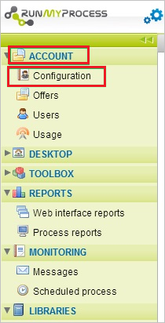
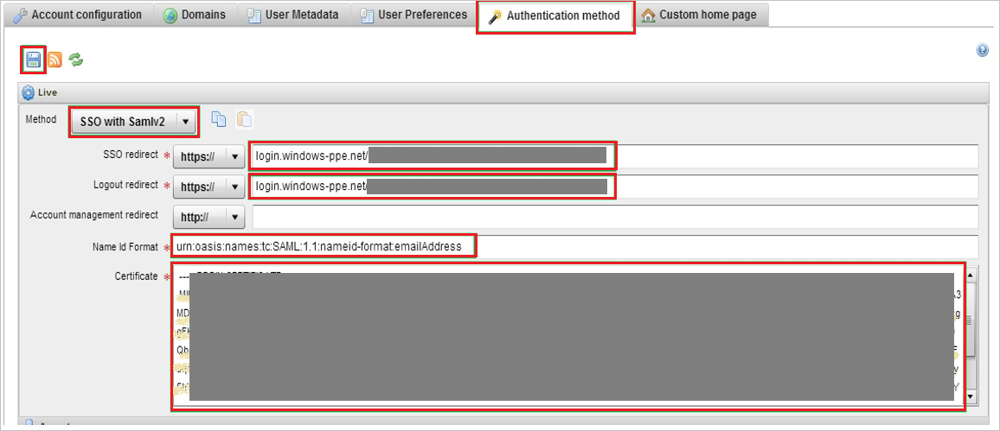

## Prerequisites

To configure Azure AD integration with RunMyProcess, you need the following items:

- An Azure AD subscription
- A RunMyProcess single sign-on enabled subscription

> **Note:**
> To test the steps in this tutorial, we do not recommend using a production environment.

To test the steps in this tutorial, you should follow these recommendations:

- Do not use your production environment, unless it is necessary.
- If you don't have an Azure AD trial environment, you can get a one-month trial [here](https://azure.microsoft.com/pricing/free-trial/).

### Configuring RunMyProcess for single sign-on

1. In a different web browser window, sign-on to your RunMyProcess tenant as an administrator.

2. In left navigation panel, click **Account** and select **Configuration**.
   
    

3. Go to **Authentication method** section and perform below steps:
   
    

    a. As **Method**, select **SSO with Samlv2**. 

    b. In the **SSO redirect** textbox paste the value of **Azure AD Single Sign-On Service URL** : %metadata:singleSignOnServiceUrl% from Azure AD application configuration wizard.

    c. In the **Logout redirect** textbox paste the value of **Azure AD Sign Out URL** : %metadata:singleSignOutServiceUrl%
    from Azure AD application configuration wizard.

    d. In the **Name Id Format** textbox put the value of **Name Identifier Format** from Azure AD application configuration wizard.

    e. Copy the content of the **[Downloaded Azure AD Signing Certifcate (Base64 encoded)](%metadata:certificateDownloadBase64Url%)** and then paste it into the **Certificate** textbox. 
 
    f. Click **Save** icon.

## Quick Reference

* **Azure AD Single Sign-On Service URL** : %metadata:singleSignOnServiceUrl%

* **Azure AD Sign Out URL** : %metadata:singleSignOutServiceUrl%

* **[Download Azure AD Signing Certifcate (Base64 encoded)](%metadata:certificateDownloadBase64Url%)**

## Additional Resources

* [How to integrate RunMyProcess with Azure Active Directory](https://docs.microsoft.com/azure/active-directory/active-directory-saas-runmyprocess-tutorial)
