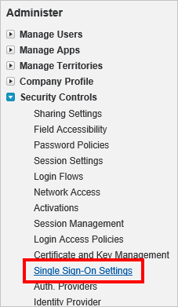
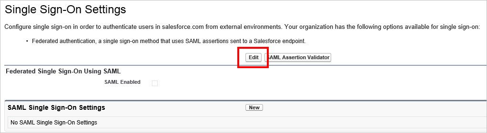
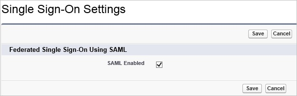
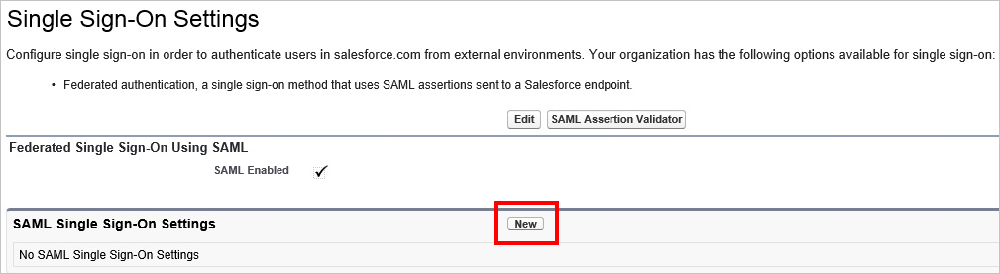
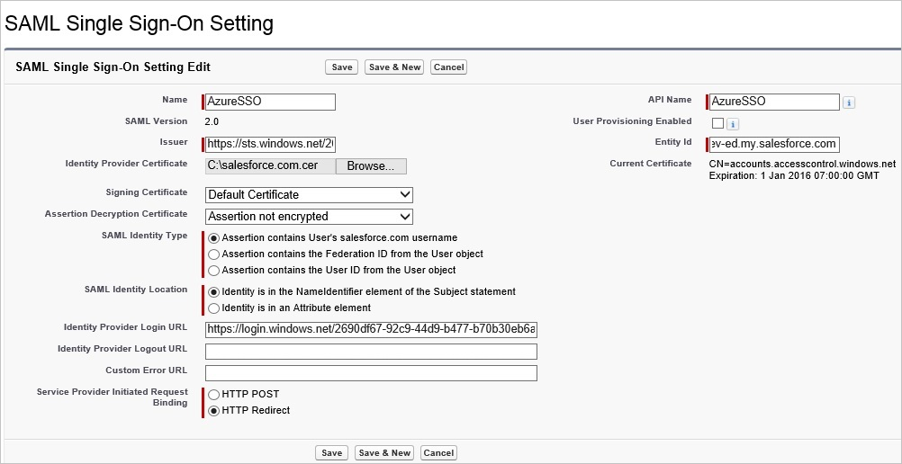
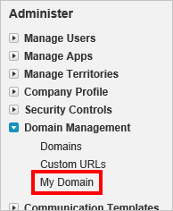
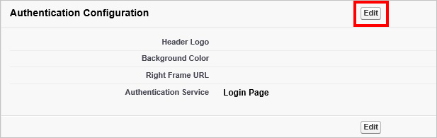
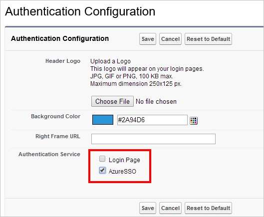

## Prerequisites

To configure Azure AD integration with Salesforce, you need the following items:

- An Azure AD subscription
- A Salesforce single-sign on enabled subscription

> **Note:**
> To test the steps in this tutorial, we do not recommend using a production environment.

To test the steps in this tutorial, you should follow these recommendations:

- Do not use your production environment, unless it is necessary.
- If you don't have an Azure AD trial environment, you can get a one-month trial [here](https://azure.microsoft.com/pricing/free-trial/).

### Configuring Salesforce for single sign-on

1.  Open a new tab in your browser and log in to your Salesforce administrator account.

2.  Under the **Administrator** navigation pane, click **Security Controls** to expand the related section. Then click **Single Sign-On Settings**.

    

3.  On the **Single Sign-On Settings** page, click the **Edit** button.

    

      > **Note:**
      > If you are unable to enable Single Sign-On settings for your Salesforce account, you may need to contact [Salesforce Client support team](https://help.salesforce.com/support) to have the feature enabled for you. 

4. Select **SAML Enabled**, and then click **Save**.

      

5. To configure your SAML single sign-on settings, click **New**.

    

6. On the **SAML Single Sign-On Setting Edit** page, make the following configurations:

    

    a. For the **Name** field, type in a friendly name for this configuration. Providing a value for **Name** automatically populate the **API Name** textbox.

    b. Paste **Azure AD SAML Entity ID** : %metadata:IssuerUri% into the **Issuer** field in Salesforce.

    c. In the **Entity Id textbox**, type your Salesforce domain name using the following pattern:
      
      * Enterprise account: `https://<subdomain>.my.salesforce.com`
      * Developer account: `https://<subdomain>-dev-ed.my.salesforce.com`
      
    d. Click **Browse** or **Choose File** to open the **Choose File to Upload** dialog, select your Salesforce certificate, and then click **Open** to upload the certificate.

    e. For **SAML Identity Type**, select **Assertion contains User's salesforce.com username**.

    f. For **SAML Identity Location**, select **Identity is in the NameIdentifier element of the Subject statement**

    g. Paste **Azure AD Single Sign-On Service URL** : %metadata:singleSignOnServiceUrl% into the **Identity Provider Login URL** field in Salesforce.
    
    h. For **Service Provider Initiated Request Binding**, select **HTTP Redirect**.
    
    i. Finally, click **Save** to apply your SAML single sign-on settings.

7. On the left navigation pane in Salesforce, click **Domain Management** to expand the related section, and then click **My Domain**.

     

8. Scroll down to the **Authentication Configuration** section, and click the **Edit** button.

    

9. In the **Authentication Service** section, select the friendly name of your SAML SSO configuration, and then click **Save**.

    

    > **Note:**
    > If more than one authentication service is selected, users are prompted to select which authentication service they like to sign in with while initiating single sign-on to your Salesforce environment. If you don’t want it to happen, then you should **leave all other authentication services unchecked**.

## Quick Reference

* **Azure AD Single Sign-On Service URL** : %metadata:singleSignOnServiceUrl%

* **Azure AD SAML Entity ID** : %metadata:IssuerUri%

* **Azure AD Sign Out URL** : %metadata:singleSignOutServiceUrl%

* **[Download Azure AD Signing Certificate](%metadata:CertificateDownloadRawUrl%)**

## Additional Resources

* [How to integrate Salesforce with Azure Active Directory](active-directory-saas-salesforce-tutorial.md)
* [How to configure user provisioning with Salesforce](active-directory-saas-salesforce-user-provisioning-tutorial.md)
