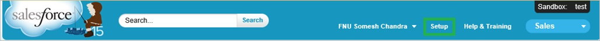
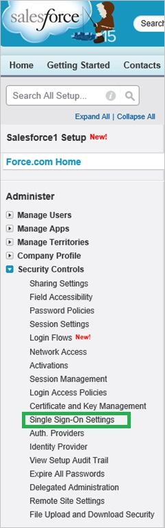
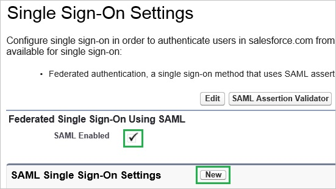
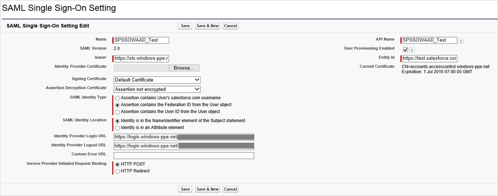
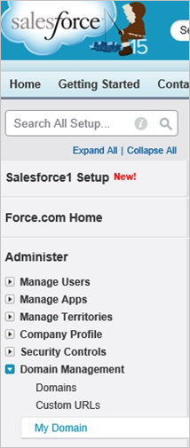
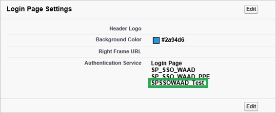

## Prerequisites

To configure Azure AD integration with Salesforce Sandbox, you need the following items:

- An Azure AD subscription
- A Salesforce Sandbox single-sign on enabled subscription

> **Note:**
> To test the steps in this tutorial, we do not recommend using a production environment.

To test the steps in this tutorial, you should follow these recommendations:

- Do not use your production environment, unless it is necessary.
- If you don't have an Azure AD trial environment, you can get a one-month trial [here](https://azure.microsoft.com/pricing/free-trial/).

### Configuring Salesforce Sandbox for single sign-on

1. Open a new tab in your browser and log in to your Salesforce Sandbox administrator account.

2. In the menu on the top, click **Setup**.

    
3. In the navigation pane on the left, click **Security Controls**, and then click **Single Sign-On Settings**.

    
4. On the Single Sign-On Settings section, perform the following steps:
     
     
     a.  Select **SAML Enabled**. 

     b.  Click **New**.

5. On the SAML Single Sign-On Settings section, perform the following steps:

    

    a.In the Name textbox, type the name of the configuration (e.g.: *SPSSOWAAD\_Test*). 

    b. Paste **Azure AD SAML Entity ID** : %metadata:IssuerUri% value into the **Issuer** textbox.

    c. In the **Entity Id** textbox, type **https://test.salesforce.com** if this is the first Salesforce Sandbox instance that you are adding to your directory. If you have already added an instance of Salesforce Sandbox, then for the **Entity ID** type in the **Sign On URL**, which should be in this format: `http://company.my.salesforce.com`  
 
    d. Click **Browse** to upload the downloaded certificate **[Azure AD Signing Certifcate](%metadata:CertificateDownloadRawUrl%)**.  

    e. As **SAML Identity Type**, select **Assertion contains the Federation ID from the User object**.
 
	f. As **SAML Identity Location**, select **Identity is in the NameIdentifier element of the Subject statement**.

    g. Paste  **Azure AD Single Sign-On Service URL** : %metadata:singleSignOnServiceUrl% into the **Identity Provider Login URL** textbox. 

    h. SFDC does not support SAML logout. As a workaround, paste **Azure AD Sign Out URL** : %metadata:singleSignOutServiceUrl% it into the **Identity Provider Logout URL** textbox.

    i. As **Service Provider Initiated Request Binding**, select **HTTP POST**. 

    j. Click **Save**.

### Enable your domain
This section assumes that you already have created a domain.  For more details, see [Defining Your Domain Name](https://help.salesforce.com/HTViewHelpDoc?id=domain_name_define.htm&language=en_US).

**To enable your domain, perform the following steps:**

1. In the left navigation pane, click **Domain Management**, and then click **My Domain.**
   
     
   
   > **Note:**
   >Please make sure that your domain has been configured correctly. 

2.In the **Login Page Settings** section, click **Edit**, then, as **Authentication Service**, select the name of the SAML Single Sign-On Setting from the previous section, and finally click **Save**.
   
   

As soon as you have a domain configured, your users should use the domain URL to login to the Salesforce sandbox.  

To get the value of the URL, click the SSO profile you have created in the previous section.    

## Quick Reference

* **Azure AD Single Sign-On Service URL** : %metadata:singleSignOnServiceUrl%

* **Azure AD SAML Entity ID** : %metadata:IssuerUri%

* **Azure AD Sign Out URL** : %metadata:singleSignOutServiceUrl%

* **[Download Azure AD Signing Certifcate](%metadata:CertificateDownloadRawUrl%)**

## Additional Resources

* [How to integrate Salesforce Sandbox with Azure Active Directory](active-directory-saas-salesforcesandbox-tutorial.md)
* [How to configure user provisioning with Salesforce Sandbox](active-directory-saas-salesforcesandbox-user-provisioning-tutorial.md)
