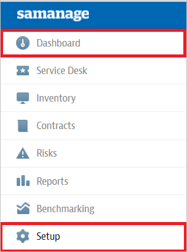
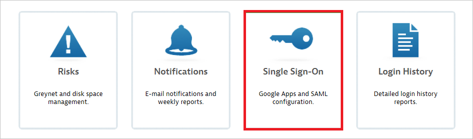
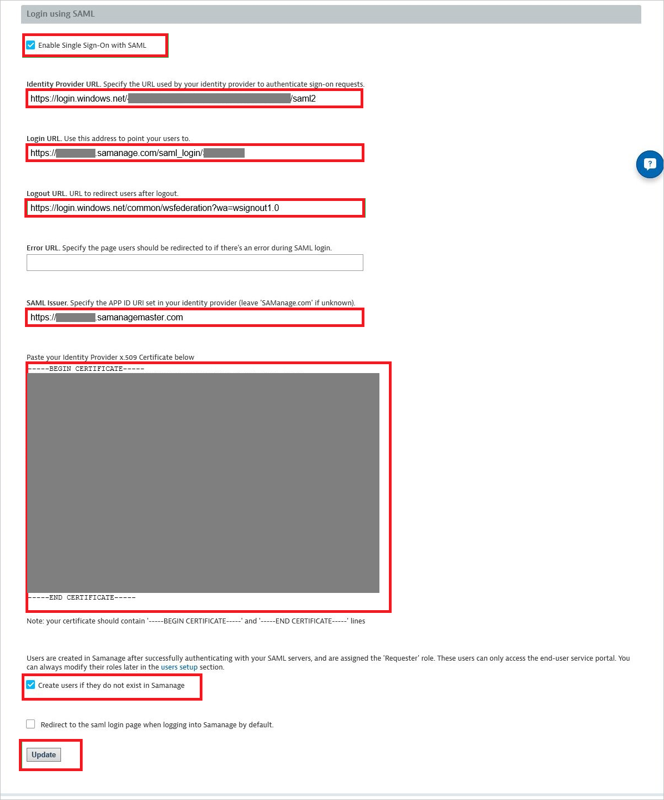

## Prerequisites

To configure Azure AD integration with Samanage, you need the following items:

- An Azure AD subscription
- A Samanage single sign-on enabled subscription

> **Note:**
> To test the steps in this tutorial, we do not recommend using a production environment.

To test the steps in this tutorial, you should follow these recommendations:

- Do not use your production environment, unless it is necessary.
- If you don't have an Azure AD trial environment, you can get a one-month trial [here](https://azure.microsoft.com/pricing/free-trial/).

### Configuring Samanage for single sign-on

1. In a different web browser window, log into your Samanage company site as an administrator.

2. Click **Dashboard** and select **Setup** in left navigation pane.
   
    

3. Click **Single Sign-On**.
   
    

4. Navigate to **Login using SAML** section, perform the following steps:
   
    
 
    a. Click **Enable Single Sign-On with SAML**.  
 
    b. In the **Identity Provider URL** textbox, enter **Azure AD SAML Entity ID** : %metadata:IssuerUri%.    
 
    c. Confirm the **Login URL** matches the **Sign On URL** of **Samanage Domain and URLs** section in Azure portal.
 
    d. In the **Logout URL** textbox, enter **Azure AD Sign Out URL** : %metadata:singleSignOutServiceUrl%.
 
    e. In the **SAML Issuer** textbox, type the app id URI set in your identity provider.
 
    f. Open your [base-64 encoded certificate](%metadata:certificateDownloadBase64Url%) downloaded from Azure portal in notepad, copy the content of it into your clipboard, and then paste it to the **Paste your Identity Provider x.509 Certificate below** textbox.
 
    g. Click **Create users if they do not exist in Samanage**.
 
    h. Click **Update**.

## Quick Reference

* **Azure AD Single Sign-On Service URL** : %metadata:singleSignOnServiceUrl%

* **Azure AD SAML Entity ID** : %metadata:IssuerUri%

* **Azure AD Sign Out URL** : %metadata:singleSignOutServiceUrl%

* **[Download Azure AD Signing Certifcate (Base64 encoded)](%metadata:certificateDownloadBase64Url%)**

## Additional Resources

* [How to integrate Samanage with Azure Active Directory](https://docs.microsoft.com/azure/active-directory/active-directory-saas-samanage-tutorial)
