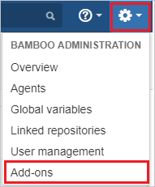
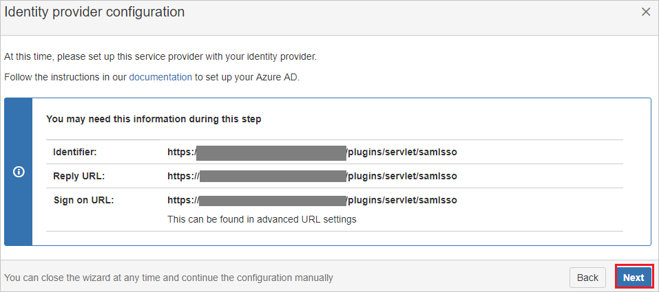

## Prerequisites

To configure Azure AD integration with SAML SSO for Bamboo by resolution GmbH, you need the following items:

- An Azure AD subscription
- A SAML SSO for Bamboo by resolution GmbH single sign-on enabled subscription

> **Note:**
> To test the steps in this tutorial, we do not recommend using a production environment.

To test the steps in this tutorial, you should follow these recommendations:

- Do not use your production environment, unless it is necessary.
- If you don't have an Azure AD trial environment, you can [get a one-month trial](https://azure.microsoft.com/pricing/free-trial/).

### Configuring SAML SSO for Bamboo by resolution GmbH for single sign-on

1. Sign-on to your SAML SSO for Bamboo by resolution GmbH company site as administrator.

2. On the right side of the main toolbar, click **Settings** > **Add-ons**.

	

3. Go to SECURITY section, click on **SAML SingleSignOn** on the Menubar.

	

4. On the **SAML SIngleSignOn Plugin Configuration page**, click **Add idp**. 

	

5. On the **Choose your SAML Identity Provider** Page, perform the following steps:

	

	a. Select **Idp Type** as **AZURE AD**.

	b. In the **Name** textbox, type the name.

	c. In the **Description** textbox, type the description.

	d. Click **Next**.

6. On the **Identity provider configuration** page click **Next**.

	

7.  On the **Import SAML Idp Metadata** Page, click **Load File** to upload the **[Downloaded SAML Metadata file](%metadata:metadataDownloadUrl%)** file from Azure Portal.

	

8. Click **Next**.

9. Click **Save settings**.

	

## Quick Reference

* **Azure AD Single Sign-On Service URL** : %metadata:singleSignOnServiceUrl%

* **[Download SAML Metadata file](%metadata:metadataDownloadUrl%)**

## Additional Resources

* [How to integrate SAML SSO for Bamboo by resolution GmbH with Azure Active Directory](https://docs.microsoft.com/azure/active-directory/active-directory-saas-bamboo-tutorial)
