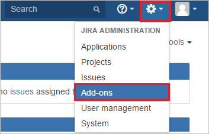

## Prerequisites

To configure Azure AD integration with SAML SSO for Jira by resolution GmbH, you need the following items:

- An Azure AD subscription
- A SAML SSO for Jira by resolution GmbH single-sign on enabled subscription

> **Note:**
> To test the steps in this tutorial, we do not recommend using a production environment.

To test the steps in this tutorial, you should follow these recommendations:

- You should not use your production environment, unless this is necessary.
- If you don't have an Azure AD trial environment, you can get an one-month trial [here](https://azure.microsoft.com/pricing/free-trial/).

### Configuring SAML SSO for Jira by resolution GmbH for single sign-on

1. In a different web browser window, log in to your **SAML SSO for Jira by resolution GmbH admin portal** as an administrator.

2. Hover on cog and click the **Add-ons**.
    
	

3. You are redirected to Administrator Access page. Enter the **Password** and click **Confirm** button.

	

4. Under Add-ons tab section, click **Find new add-ons**. Search **SAML Single Sign On (SSO) for JIRA** and click **Install** button to install the new SAML plugin.

	

5. The plugin installation will start. Click **Close**.

	

	

6.	Click **Manage**.

	
    
7. Click **Configure** to configure the new plugin.

	

8. On **SAML SingleSignOn Plugin Configuration** page, click **Add additional Identity Provider** button to configure the settings of Identity Provider.

	

9. Perform following steps on this page:

	
 
	a. Add **Name** of the Identity Provider (e.g Azure AD).
	
	b. Add **Description** of the Identity Provider (e.g Azure AD).

	c. Click **XML** and select the **[SAML Metadata file](%metadata:metadataDownloadUrl%)** file, which you have downloaded from Azure portal.

	d. Click **Load** button.

    e. It reads the IdP metadata and populates the fields as highlighted in the screenshot.	

10. Click **Save settings** button to save the settings.

	

## Quick Reference

* **[Download SAML Metadata file](%metadata:metadataDownloadUrl%)**

## Additional Resources

* [How to integrate SAML SSO for Jira by resolution GmbH with Azure Active Directory](active-directory-saas-samlssojira-tutorial.md)
