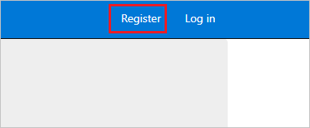
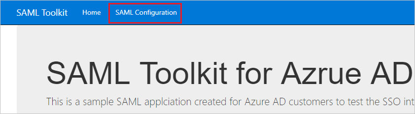
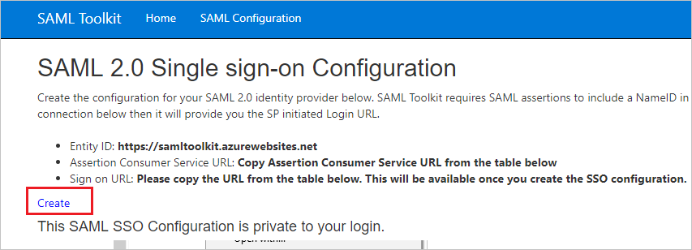
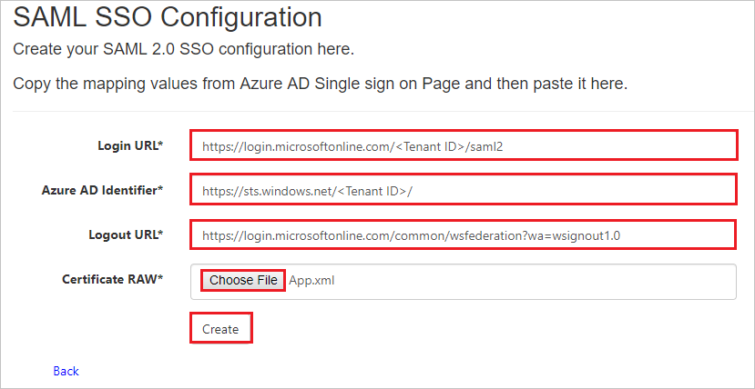

## Prerequisites

To configure Azure AD integration with SAML Toolkit, you need the following items:

- An Azure AD subscription
- A SAML Toolkit single sign-on enabled subscription

> **Note:**
> To test the steps in this tutorial, we do not recommend using a production environment.

To test the steps in this tutorial, you should follow these recommendations:

- Do not use your production environment, unless it is necessary.
- If you don't have an Azure AD trial environment, you can get a [free account](https://azure.microsoft.com/free/).

### Configuring SAML Toolkit for single sign-on

1. Open a new web browser window, if you have not registered in the Azure AD SAML Toolkit website, first register by clicking on the **Register**. If you have registered already, sign into your Azure AD SAML Toolkit company site using the registered sign in credentials.

	

1. Click on the **SAML Configuration**.

	

1. Click **Create**.

	

1. On the **SAML SSO Configuration** page, perform the following steps:

	

	1. In the **Login URL** textbox, paste the **Login URL** : %metadata:singleSignOnServiceUrl% value, which you have copied from the Azure portal.

	1. In the **Azure AD Identifier** textbox, paste the **Azure AD Identifier** value, which you have copied from the Azure portal.

	1. In the **Logout URL** textbox, paste the **Logout URL** value, which you have copied from the Azure portal.

	1. Click **Choose File** and upload the **Federation metadata XML** file which you have downloaded from the Azure portal.

	1. Click **Create**.

## Quick Reference

* **Login URL** : %metadata:singleSignOnServiceUrl%

* **[Download Azure AD Signing Certifcate](%metadata:CertificateDownloadRawUrl%)**

## Additional Resources

* [How to integrate SAML Toolkit with Azure Active Directory](https://docs.microsoft.com/azure/active-directory/saas-apps/saml-toolkit-tutorial)
