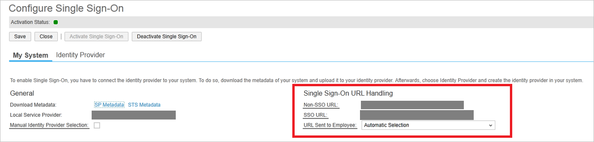

## Prerequisites

To configure Azure AD integration with SAP Business ByDesign, you need the following items:

- An Azure AD subscription
- A SAP Business ByDesign single sign-on enabled subscription

> **Note:**
> To test the steps in this tutorial, we do not recommend using a production environment.

To test the steps in this tutorial, you should follow these recommendations:

- Do not use your production environment, unless it is necessary.
- If you don't have an Azure AD trial environment, you can [get a one-month trial](https://azure.microsoft.com/pricing/free-trial/).

### Configuring SAP Business ByDesign for single sign-on

1. To get SSO configured for your application, perform the following steps:
   
    a. Sign on to your SAP Business ByDesign portal with administrator rights.
   
    b. Navigate to **Application and User Management Common Task** and click the **Identity Provider** tab.
   
    c. Click **New Identity Provider** and select the metadata XML file that you have downloaded from the Azure portal. By importing the metadata, the system automatically uploads the required signature certificate and encryption certificate.
   
    
   
    d. To include the **Assertion Consumer Service URL** into the SAML request, select **Include Assertion Consumer Service URL**.
   
    e. Click **Activate Single Sign-On**.
   
    f. Save your changes.
   
    g. Click the **My System** tab.
   
    
   
    h. Paste **SAML Single Sign-On Service URL**, which you have copied from the Azure portal it into the **Azure AD Sign On URL** textbox.
   
    
   
    i. Specify whether the employee can manually choose between logging on with user ID and password or SSO by selecting **Manual Identity Provider Selection**.
   
    j. In the **SSO URL** section, specify the URL that should be used by the employee to logon to the system. 
    In the URL Sent to Employee dropdown list, you can choose between the following options:
   
    **Non-SSO URL**
   
    The system sends only the normal system URL to the employee. The employee cannot log on using SSO, and must use password or certificate instead.
   
    **SSO URL** 
   
    The system sends only the SSO URL to the employee. The employee can log on using SSO. Authentication request is redirected through the IdP.
   
    **Automatic Selection**
   
    If SSO is not active, the system sends the normal system URL to the employee. If SSO is active, the system checks whether the employee has a password. If a password is available, both SSO URL and Non-SSO URL are sent to the employee. However, if the employee has no password, only the SSO URL is sent to the employee.
   
    k. Save your changes.

## Quick Reference

* **[Download SAML Metadata file](%metadata:metadataDownloadUrl%)**

## Additional Resources

* [How to integrate SAP Business ByDesign with Azure Active Directory](https://docs.microsoft.com/en-us/azure/active-directory/active-directory-saas-sapbusinessbydesign-tutorial)
