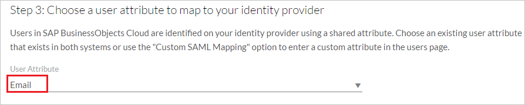

## Prerequisites

To configure Azure AD integration with SAP Business Object Cloud, you need the following items:

- An Azure AD subscription
- A SAP Business Object Cloud single sign-on enabled subscription

> **Note:**
> To test the steps in this tutorial, we do not recommend using a production environment.

To test the steps in this tutorial, you should follow these recommendations:

- Do not use your production environment, unless it is necessary.
- If you don't have an Azure AD trial environment, you can [get a one-month trial](https://azure.microsoft.com/pricing/free-trial/).

### Configuring SAP Business Object Cloud for single sign-on

1. In a different web browser window, log in to your SAP Business Object Cloud company site as an administrator.

2. Go to **Menu > System > Administration**
    
        
3. On **Security** tab click **[Edit – pen icon]**.
    
        
4. Select **SAML Single Sign-On (SSO)** as Authentication Method.

      

5. Click **Download** to download the Service Provider metadata. Retrieve **entityID** value from the file and paste it in **Identifier** textbox in **SAP Business Object Cloud Domain and URLs** section on Azure portal.

	  

6. In **Upload Identity Provider metadata** step click **Upload..** button to upload the **[Downloaded SAML Metadata file](%metadata:metadataDownloadUrl%)** from Azure portal. 

	

7. Select the appropriate **User Attribute** you want to use for your implementation from list to map to Identity provider. Use the "Custom SAML Mapping" option to enter a custom attribute in the users page or select either "Email" or "USER ID" as the user Attribute. E.x. **Email** is selected here as we have mapped the user identifier claim with the userprincipalname attribute in the **"User Attributes"** section on Azure portal, which provides unique user email, which is sent to the SAP Business Object Cloud application in every successful SAML Response.

	

8. Enter your Email in **Login Credential (Email)** text box and click **Verify Account** button to allow the system to add your login credential to your account.

    

9. Click **Save icon**

	

## Quick Reference

* **[Download SAML Metadata file](%metadata:metadataDownloadUrl%)**

## Additional Resources

* [How to integrate SAP Business Object Cloud with Azure Active Directory](https://docs.microsoft.com/azure/active-directory/active-directory-saas-sapboc-tutorial)
