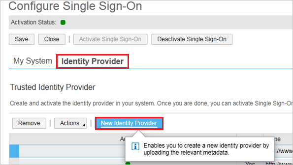
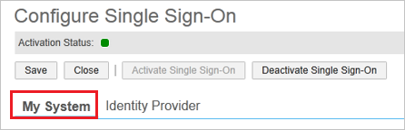
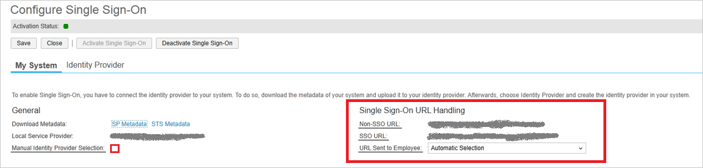

## Prerequisites

To configure Azure AD integration with SAP Cloud for Customer, you need the following items:

- An Azure AD subscription
- A SAP Cloud for Customer single sign-on enabled subscription

> **Note:**
> To test the steps in this tutorial, we do not recommend using a production environment.

To test the steps in this tutorial, you should follow these recommendations:

- Do not use your production environment, unless it is necessary.
- If you don't have an Azure AD trial environment, you can get a one-month trial [here](https://azure.microsoft.com/pricing/free-trial/).

### Configuring SAP Cloud for Customer for single sign-on

8. To get SSO configured, perform the following steps:
   
    a. Login into SAP Cloud for Customer portal with administrator rights.
   
    b. Navigate to the **Application and User Management Common Task** and click the **Identity Provider** tab.
   
    c. Click **New Identity Provider** and select the [metadata XML](%metadata:metadataDownloadUrl%) file you have downloaded from the Azure portal. By importing the metadata, the system automatically uploads the required signature certificate and encryption certificate.
   
    
   
    d. Azure Active Directory requires the element Assertion Consumer Service URL in the SAML request, so select the **Include Assertion Consumer Service URL** checkbox.
   
    e. Click **Activate Single Sign-On**.
   
    f. Save your changes.
   
    g. Click the **My System** tab.
   
    
   
    h. In **Azure AD Sign On URL** textbox, enter **Azure AD Single Sign-On Service URL** : %metadata:singleSignOnServiceUrl%.
   
    
   
    i. Specify whether the employee can manually choose between logging on with user ID and password or SSO by selecting the **Manual Identity Provider Selection**.
   
    j. In the **SSO URL** section, specify the URL that should be used by your employees to sign on to the system. 
    In the **URL Sent to Employee** list, you can choose between the following options:
   
    **Non-SSO URL**
   
    The system sends only the normal system URL to the employee. The employee cannot log on using SSO, and must use password or certificate instead.
   
    **SSO URL** 
   
    The system sends only the SSO URL to the employee. The employee can log on using SSO. Authentication request is redirected through the IdP.
   
    **Automatic Selection**
   
    If SSO is not active, the system sends the normal system URL to the employee. If SSO is active, the system checks whether the employee has a password. If a password is available, both SSO URL and Non-SSO URL are sent to the employee. However, if the employee has no password, only the SSO URL is sent to the employee.
   
    k. Save your changes.

## Quick Reference

* **Azure AD Single Sign-On Service URL** : %metadata:singleSignOnServiceUrl%

* **[Download SAML Metadata file](%metadata:metadataDownloadUrl%)**

## Additional Resources

* [How to integrate SAP Cloud for Customer with Azure Active Directory](https://docs.microsoft.com/azure/active-directory/active-directory-saas-sap-customer-cloud-tutorial)
