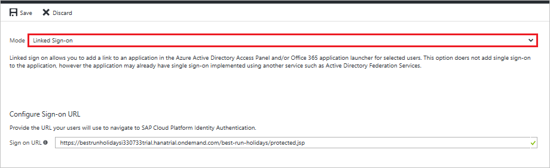

## Prerequisites

To configure Azure AD integration with SAP Cloud Platform Identity Authentication, you need the following items:

- An Azure AD subscription
- A SAP Cloud Platform Identity Authentication single sign-on enabled subscription

> **Note:**
> To test the steps in this tutorial, we do not recommend using a production environment.

To test the steps in this tutorial, you should follow these recommendations:

- Do not use your production environment, unless it is necessary.
- If you don't have an Azure AD trial environment, you can [get a one-month trial](https://azure.microsoft.com/pricing/free-trial/).

### Configuring SAP Cloud Platform Identity Authentication for single sign-on

1. To get SSO configured for your application, go to SAP Cloud Platform Identity Authentication Administration Console. The URL has the following pattern: `https://<tenant-id>.accounts.ondemand.com/admin`. Then, follow the documentation on SAP Cloud Platform Identity Authentication to [Configure Microsoft Azure AD as Corporate Identity Provider at SAP Cloud Platform Identity Authentication](https://help.hana.ondemand.com/cloud_identity/frameset.htm?626b17331b4d4014b8790d3aea70b240.html). 

2. In the Azure portal, click **Save** button.

3. Continue the following steps only if you want to add and enable SSO for another SAP application. Repeat steps under the section “Adding SAP Cloud Platform Identity Authentication from the gallery” to add another instance of SAP Cloud Platform Identity Authentication.

4. In the Azure portal, on the **SAP Cloud Platform Identity Authentication** application integration page, click **Linked Sign-on**.

 	

5. Save the configuration.

>[!NOTE] 
>The new application will leverage the SSO configuration for the previous SAP application. Please make sure you use the same Corporate Identity Providers in the SAP Cloud Platform Identity Authentication Administration Console.

## Quick Reference

* **[Download Azure AD Signing Certifcate](%metadata:CertificateDownloadRawUrl%)**

* **[Download SAML Metadata file](%metadata:metadataDownloadUrl%)**

## Additional Resources

* [How to integrate SAP Cloud Platform Identity Authentication with Azure Active Directory](https://docs.microsoft.com/azure/active-directory/active-directory-saas-sap-hana-cloud-platform-identity-authentication-tutorial)
