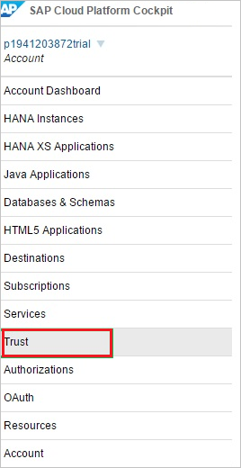
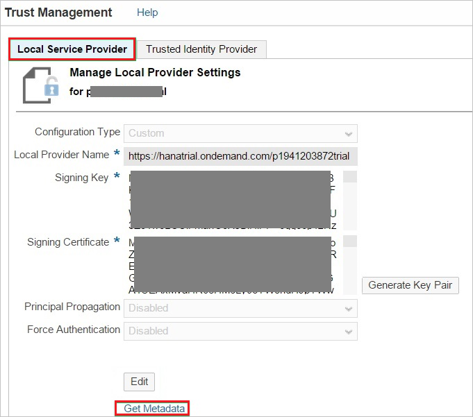
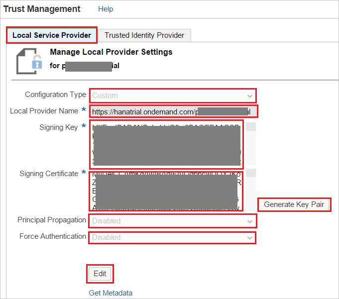
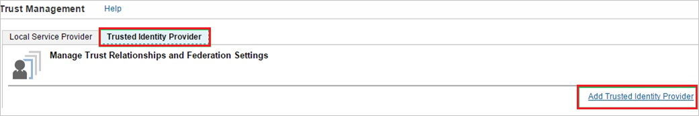
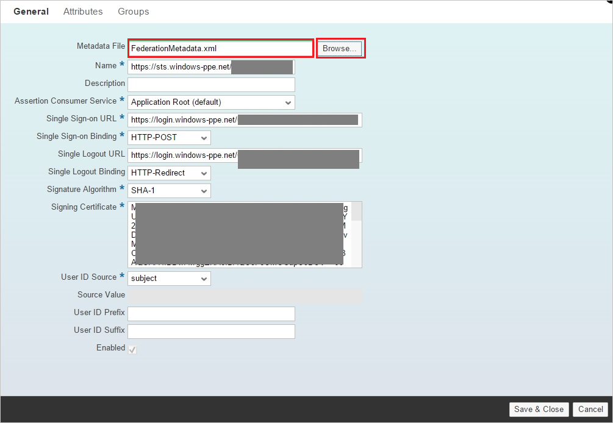
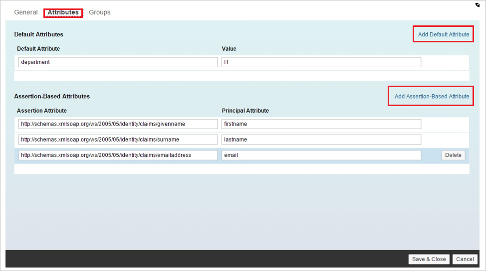

## Prerequisites

To configure Azure AD integration with SAP Cloud Platform, you need the following items:

- An Azure AD subscription
- A SAP Cloud Platform single sign-on enabled subscription

> **Note:**
> To test the steps in this tutorial, we do not recommend using a production environment.

To test the steps in this tutorial, you should follow these recommendations:

- Do not use your production environment, unless it is necessary.
- If you don't have an Azure AD trial environment, you can [get a one-month trial](https://azure.microsoft.com/pricing/free-trial/).

### Configuring SAP Cloud Platform for single sign-on

1. In a different web browser window, sign on to the SAP Cloud Platform Cockpit at `https://account.\<landscape host\>.ondemand.com/cockpit`(for example: https://account.hanatrial.ondemand.com/cockpit).

2. Click the **Trust** tab.
   
    

3. In trust management section, perform the following steps:
   
    
   
    a. Click the **Local Service Provider** tab.
 
    b. To download the SAP Cloud Platform metadata file, click **Get Metadata**.

    c. Open the downloaded SAP Cloud Platform metadata file, and then locate the **ns3:AssertionConsumerService** tag.
 
    d. Copy the value of the **Location** attribute, and then paste it into the **SAP Cloud Platform Reply URL** textbox.

4. On the SAP Cloud Platform Cockpit, in the **Local Service Provider** section, perform the following steps:
   
    
   
    a. Click **Edit**.

    b. As **Configuration Type**, select **Custom**.

    c. As **Local Provider Name**, leave the default value.

    d. To generate a **Signing Key** and a **Signing Certificate** key pair, click **Generate Key Pair**.

    e. As **Principal Propagation**, select **Disabled**.

    f. As **Force Authentication**, select **Disabled**.

    g. Click **Save**.

5. Click the **Trusted Identity Provider** tab, and then click **Add Trusted Identity Provider**.
   
    
   
    >[!NOTE]
    >To manage the list of trusted identity providers, you need to have chosen the Custom configuration type in the Local Service Provider section. For Default configuration type, you have a non-editable and implicit trust to the SAP ID Service. For None, you don't have any trust settings.
    > 
    > 

6. Click the **General** tab, and then click **Browse** to upload the downloaded metadata file.
    
    
    
    >[!NOTE]
    >After uploading the metadata file, the values for **Single Sign-on URL**, **Single Logout URL**, and **Signing Certificate** are populated automatically.
    > 
     
7. Click the **Attributes** tab.

8. On the **Attributes** tab, perform the following step:
    
     

    a. Click **Add Assertion-Based Attribute**, and then add the following assertion-based attributes:
       
    | Assertion Attribute | Principal Attribute |
    | --- | --- |
    | `http://schemas.xmlsoap.org/ws/2005/05/identity/claims/givenname` |firstname |
    | `http://schemas.xmlsoap.org/ws/2005/05/identity/claims/surname` |lastname |
    | `http://schemas.xmlsoap.org/ws/2005/05/identity/claims/emailaddress` |email |
   
     >[!NOTE]
     >The configuration of the Attributes depends on how the application(s) on SCP are developed, that is, which attribute(s) they expect in the SAML response and under which name (Principal Attribute) they access this attribute in the code.
     > 
    
    b. The **Default Attribute** in the screenshot is just for illustration purposes. It is not required to make the scenario work.  
 
    c. The names and values for **Principal Attribute** shown in the screenshot depend on how the application is developed. It is possible that your application requires different mappings.

## Quick Reference

* **[Download Azure AD Signing Certifcate](%metadata:CertificateDownloadRawUrl%)**

## Additional Resources

* [How to integrate SAP Cloud Platform with Azure Active Directory](https://docs.microsoft.com/azure/active-directory/active-directory-saas-sap-hana-cloud-platform-tutorial)
