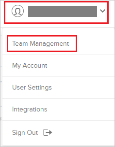
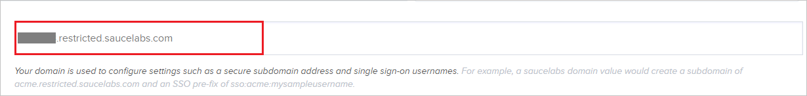
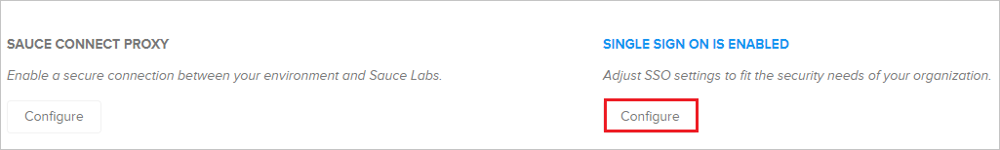
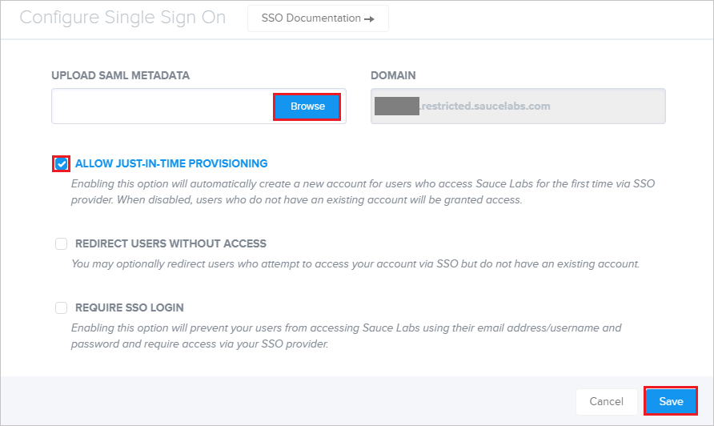

## Prerequisites

To configure Azure AD integration with Sauce Labs - Mobile and Web Testing, you need the following items:

- An Azure AD subscription
- A Sauce Labs - Mobile and Web Testing single sign-on enabled subscription

> **Note:**
> To test the steps in this tutorial, we do not recommend using a production environment.

To test the steps in this tutorial, you should follow these recommendations:

- Do not use your production environment, unless it is necessary.
- If you don't have an Azure AD trial environment, you can [get a one-month trial](https://azure.microsoft.com/pricing/free-trial/).

### Configuring Sauce Labs - Mobile and Web Testing for single sign-on

1. In a different web browser window, sign in to your Sauce Labs - Mobile and Web Testing company site as an administrator.

2. Click on the **User icon** and select **Team Management** tab.

	

3. Enter your **Domain name** in the textbox.

	

4. Click **Configure** tab.

	

5. In the **Configure Single Sign On** section, perform the following steps.

	

	a. Click **Browse** and upload the **[Downloaded SAML Metadata file](%metadata:metadataDownloadUrl%)** from the Azure AD.

	b. Select the **ALLOW JUST-IN-TIME PROVISIONING** checkbox.

	c. Clcik **Save**.

## Quick Reference

* **[Download SAML Metadata file](%metadata:metadataDownloadUrl%)**

## Additional Resources

* [How to integrate Sauce Labs - Mobile and Web Testing with Azure Active Directory](https://docs.microsoft.com/azure/active-directory/saas-apps/saucelabs-mobileandwebtesting-tutorial)
