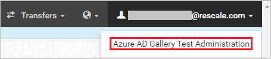
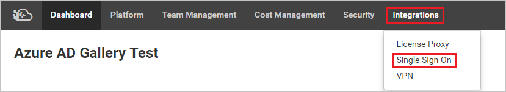
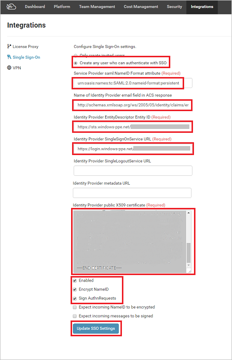

## Prerequisites

To configure Azure AD integration with Scalex Enterprise, you need the following items:

- An Azure AD subscription
- A Scalex Enterprise single-sign on enabled subscription

> [!Note]:
> To test the steps in this tutorial, we do not recommend using a production environment.

To test the steps in this tutorial, you should follow these recommendations:

- Do not use your production environment, unless it is necessary.
- If you don't have an Azure AD trial environment, you can get a one-month trial [here](https://azure.microsoft.com/pricing/free-trial/).

### Configuring Scalex Enterprise for single sign-on

1. To configure single sign-on on **ScaleX Enterprise** side, login to the ScaleX Enterprise company website as an administrator.

2. Click the menu in the upper right and select **Azure AD Gallery Test Administration**.

	 

3. Select **Integrations** from the top menu and select **Single Sign-On**.

	 

4. Complete the form as follows:

	 
	
	a. Select **“Create any user who can authenticate with SSO.”**

	b. **Service Provider saml**: Paste the value ***urn:oasis:names:tc:SAML:2.0:nameid-format:persistent***

	c. **Name of Identity Provider email field in ACS response**: Paste the value ***http://schemas.xmlsoap.org/ws/2005/05/identity/claims/emailaddress***

	d. **Identity Provider EntityDescriptor Entity ID:** enter **Azure AD SAML Entity ID** : %metadata:IssuerUri%.

	e. **Identity Provider SingleSignOnService URL:** enter **Azure AD Single Sign-On Service URL** : %metadata:singleSignOnServiceUrl%.

	f. **Identity Provider public X509 certificate:** Open the X509 certificate downloaded from the Azure in notepad and paste the contents in this box. Ensure there are no line breaks in the middle of the certificate contents.
	
	g. Check the following checkboxes: **Enabled, Encrypt NameID and Sign AuthnRequests.**

	h. To save the settings Click **Update SSO Settings**.

## Quick Reference

* **Azure AD Single Sign-On Service URL** : %metadata:singleSignOnServiceUrl%

* **Azure AD SAML Entity ID** : %metadata:IssuerUri%

* **[Download Azure AD Signing Certificate (Base64 encoded)](%metadata:certificateDownloadBase64Url%)**

## Additional Resources

* [How to integrate Scalex Enterprise with Azure Active Directory](active-directory-saas-scalexenterprise-tutorial.md)

