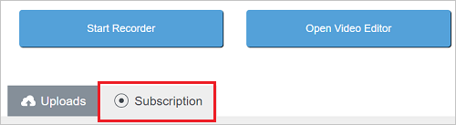
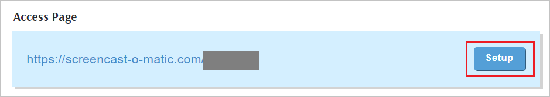
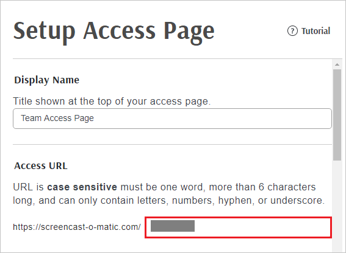
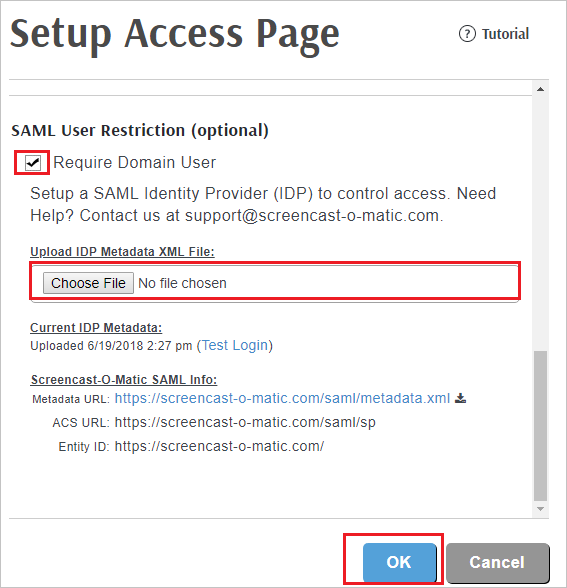

## Prerequisites

To configure Azure AD integration with Screencast, you need the following items:

- An Azure AD subscription
- A Screencast single sign-on enabled subscription

> **Note:**
> To test the steps in this tutorial, we do not recommend using a production environment.

To test the steps in this tutorial, you should follow these recommendations:

- Do not use your production environment, unless it is necessary.
- If you don't have an Azure AD trial environment, you can [get a one-month trial](https://azure.microsoft.com/pricing/free-trial/).

### Configuring Screencast for single sign-on

1. In a different web browser window, login to Screencast-O-Matic as an Administrator.

2. Click on **Subscription**.

	

3. Under **Access page** section, Click **Setup**.

	

4. On the **Setup Access Page**, perform the following steps:

	* Under **Access URL** section, type your instancename in the specified textbox.

	

	* Select **Require Domain User** under **SAML User Restriction (optional)** section.

	* Under **Upload IDP Metadata XML File**, Click **Choose File** to upload the **[Downloaded SAML Metadata file](%metadata:metadataDownloadUrl%)** from Azure portal.

	* Click **OK**.	

	

## Quick Reference

* **Azure AD Single Sign-On Service URL** : %metadata:singleSignOnServiceUrl%

* **[Download Azure AD Signing Certifcate](%metadata:CertificateDownloadRawUrl%)**

* **[Download SAML Metadata file](%metadata:metadataDownloadUrl%)**

## Additional Resources

* [How to integrate Screencast with Azure Active Directory](https://docs.microsoft.com/azure/active-directory/saas-apps/screencast-tutorial)
