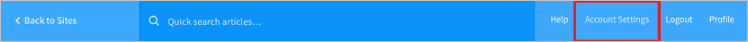
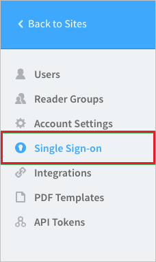
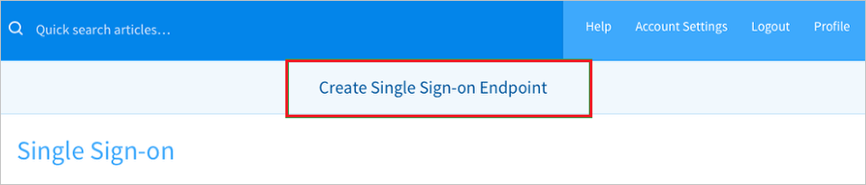
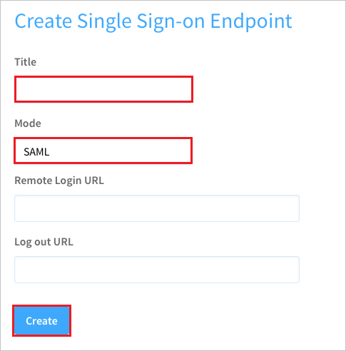
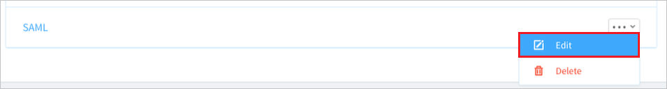
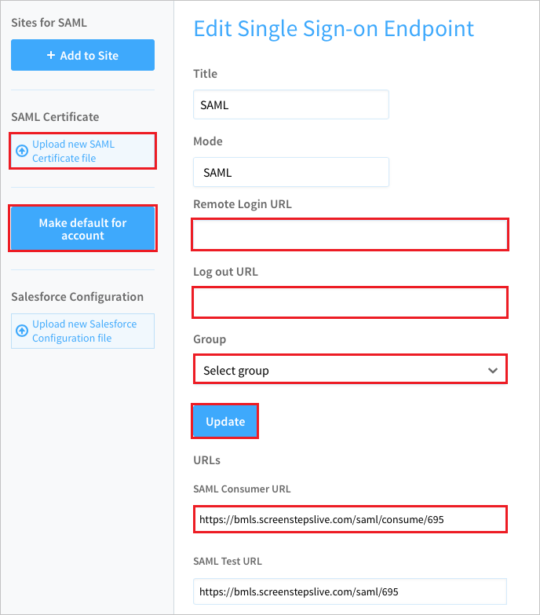

## Prerequisites

To configure Azure AD integration with ScreenSteps, you need the following items:

- An Azure AD subscription
- A ScreenSteps single sign-on enabled subscription

> **Note:**
> To test the steps in this tutorial, we do not recommend using a production environment.

To test the steps in this tutorial, you should follow these recommendations:

- Do not use your production environment, unless it is necessary.
- If you don't have an Azure AD trial environment, you can [get a one-month trial](https://azure.microsoft.com/pricing/free-trial/).

### Configuring ScreenSteps for single sign-on

1. In a different web browser window, log into your ScreenSteps company site as an administrator.

2. Click **Account Management**.

    

3. Click **Single Sign-on**.

    

4. Click **Create Single Sign-on Endpoint**.

    

5. In the **Create Single Sign-on Endpoint** section, perform the following steps:

    
	
	a. In the **Title** textbox, type a title.
    
	b. From the **Mode** list, select **SAML**.
    
	c. Click **Create**.

6. Edit the new endpoint.

    

7. In the **Edit Single Sign-on Endpoint** section, perform the following steps:

    

    a. Click **Upload new SAML Certificate file**, and then upload the certificate, which you have **[Downloaded Azure AD Signing Certifcate (Base64 encoded)](%metadata:certificateDownloadBase64Url%)** from Azure portal.
    
	b. Paste **Azure AD Single Sign-On Service URL** : %metadata:singleSignOnServiceUrl% value, which you have copied from the Azure portal into the **Remote Login URL** textbox.
    
	c. Paste **Azure AD Sign Out URL** : %metadata:singleSignOutServiceUrl% value, which you have copied from the Azure portal into the **Log out URL** textbox.
    
	d. Select a **Group** to assign users to when they are provisioned.
    
	e. Click **Update**.

	f. Copy the **SAML Consumer URL** to the clipboard and paste in to the **Sign-on URL** textbox in **ScreenSteps Domain and URLs** section.
    
	g. Return to the **Edit Single Sign-on Endpoint**.
    
	h. Click the **Make default for account** button to use this endpoint for all users who log into ScreenSteps. Alternatively you can click the **Add to Site** button to use this endpoint for specific sites in **ScreenSteps**.

## Quick Reference

* **Azure AD Single Sign-On Service URL** : %metadata:singleSignOnServiceUrl%

* **Azure AD Sign Out URL** : %metadata:singleSignOutServiceUrl%

* **[Download Azure AD Signing Certifcate (Base64 encoded)](%metadata:certificateDownloadBase64Url%)**

## Additional Resources

* [How to integrate ScreenSteps with Azure Active Directory](https://docs.microsoft.com/azure/active-directory)
