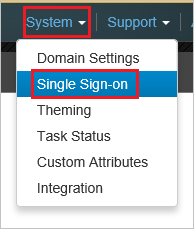
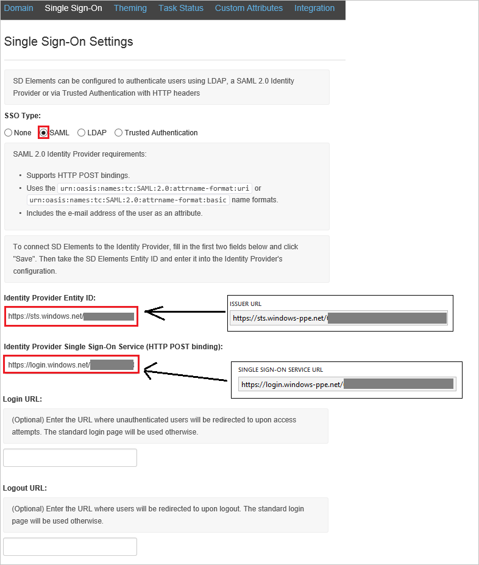

## Prerequisites

To configure Azure AD integration with SD Elements, you need the following items:

- An Azure AD subscription
- A SD Elements single sign-on enabled subscription

> **Note:**
> To test the steps in this tutorial, we do not recommend using a production environment.

To test the steps in this tutorial, you should follow these recommendations:

- Do not use your production environment, unless it is necessary.
- If you don't have an Azure AD trial environment, you can get a one-month trial here: [Trial offer](https://azure.microsoft.com/pricing/free-trial/).

### Configuring SD Elements for single sign-on

1. In a different browser window, sign-on to your SD Elements tenant as an administrator.

2. In the menu on the top, click **System**, and then **Single Sign-on**. 
   
     

3. On the **Single Sign-On Settings** dialog, perform the following steps:
   
     
   
    a. As **SSO Type**, select **SAML**.
   
    b. In the **Identity Provider Entity ID** textbox, paste the value of **Azure AD SAML Entity ID** : %metadata:IssuerUri%, which you have copied from Azure portal. 
   
    c. In the **Identity Provider Single Sign-On Service** textbox, paste the value of **Azure AD Single Sign-On Service URL** : %metadata:singleSignOnServiceUrl%, which you have copied from Azure portal. 
   
    d. Click **Save**.

## Quick Reference

* **Azure AD Single Sign-On Service URL** : %metadata:singleSignOnServiceUrl%

* **Azure AD Sign Out URL** : %metadata:singleSignOutServiceUrl%

* **Azure AD SAML Entity ID** : %metadata:IssuerUri%

* **[Download Azure AD Signing Certifcate (Base64 encoded)](%metadata:certificateDownloadBase64Url%)**

## Additional Resources

* [How to integrate SD Elements with Azure Active Directory](https://docs.microsoft.com/azure/active-directory/active-directory-saas-sd-elements-tutorial)
