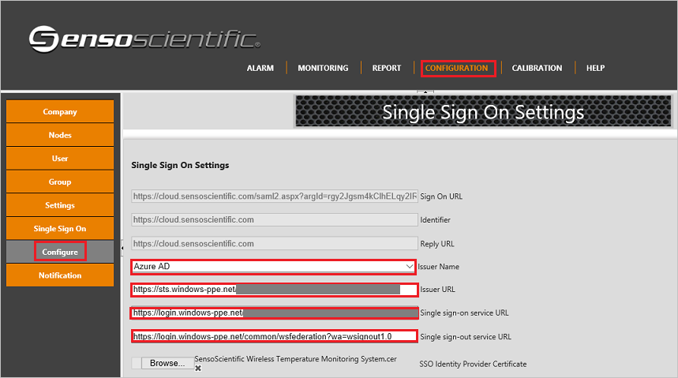

## Prerequisites

To configure Azure AD integration with SensoScientific Wireless Temperature Monitoring System, you need the following items:

- An Azure AD subscription
- A SensoScientific Wireless Temperature Monitoring System single-sign on enabled subscription

> **Note:**:
> To test the steps in this tutorial, we do not recommend using a production environment.

To test the steps in this tutorial, you should follow these recommendations:

- Do not use your production environment, unless it is necessary.
- If you don't have an Azure AD trial environment, you can get a one-month trial [here](https://azure.microsoft.com/pricing/free-trial/).

### Configuring SensoScientific Wireless Temperature Monitoring System for single sign-on

1. Sign on to your SensoScientific Wireless Temperature Monitoring System application as an administrator.

2. In the navigation menu on the top, click **Configuration** and goto **Configure** under **Single Sign On** to open the Single Sign On Settings.

	 

3. In **Single Sign On Settings** form perform the following steps:
 
    a. Select **Issuer Name** as Azure AD.
	
	b. Enter the **Azure AD SAML Entity ID**: %metadata:IssuerUri% in the Issuer URL textbox.
	
	c. Enter the **Azure AD Single Sign-On Service URL**: %metadata:singleSignOnServiceUrl% in the Single Sign-On Service URL textbox.

	d. Enter the **Azure AD Sign Out URL**: %metadata:singleSignOutServiceUrl% in the Single Sign-Out Service URL textbox.

	e. Click **Save**.

## Quick Reference

* **Azure AD Single Sign-On Service URL**: %metadata:singleSignOnServiceUrl%

* **Azure AD Sign Out URL**: %metadata:singleSignOutServiceUrl%

* **Azure AD SAML Entity ID**: %metadata:IssuerUri%

* **[Download Azure AD Signing Certificate (Base64 encoded)](%metadata:certificateDownloadBase64Url%)**

## Additional Resources

* [How to integrate SensoScientific Wireless Temperature Monitoring System with Azure Active Directory](active-directory-saas-sensoscientificwirelesstemperature monitoringsystem-tutorial.md)

