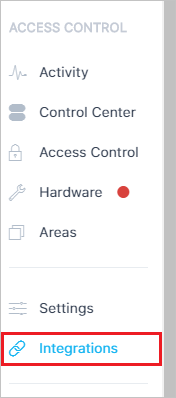
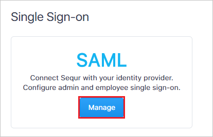
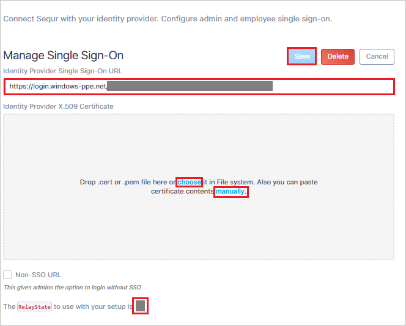

## Prerequisites

To configure Azure AD integration with Sequr, you need the following items:

- An Azure AD subscription
- A Sequr single sign-on enabled subscription

> **Note:**
> To test the steps in this tutorial, we do not recommend using a production environment.

To test the steps in this tutorial, you should follow these recommendations:

- Do not use your production environment, unless it is necessary.
- If you don't have an Azure AD trial environment, you can [get a one-month trial](https://azure.microsoft.com/pricing/free-trial/).

### Configuring Sequr for single sign-on

1. In a different web browser window, log in to your Sequr company site as an administrator.

2. Click on the **Integrations** from the left navigation panel.

	

3. Scroll down to the **Single Sign-On** section and click **Manage**.

	

4. In the **Manage Single Sign-On** section, perform the following steps:

	

	a. In the **Identity Provider Single Sign-On URL** textbox, paste the **Azure AD Single Sign-On Service URL** : %metadata:singleSignOnServiceUrl% value, which you have copied from the Azure portal.

	b. Drag and drop the **Certificate** file, which you have **[Downloaded Azure AD Signing Certifcate (Base64 encoded)](%metadata:certificateDownloadBase64Url%)** from the Azure portal or manually enter the content of the certificate.

	c. After saving the configuration, the relay state value will be generated. Copy the **relay state** value and paste it in the **Relay State** textbox of **Sequr Domain and URLs** section in the Azure portal.

	d. Click **Save**.

## Quick Reference

* **Azure AD Single Sign-On Service URL** : %metadata:singleSignOnServiceUrl%

* **[Download Azure AD Signing Certifcate (Base64 encoded)](%metadata:certificateDownloadBase64Url%)**

## Additional Resources

* [How to integrate Sequr with Azure Active Directory](https://docs.microsoft.com/azure/active-directory/active-directory-saas-sequr-tutorial)
